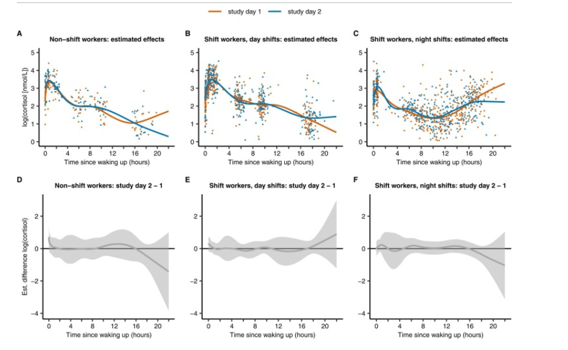

# Reproducibility issues in a scientific publication. 

<h3>  Open Peer Review scientific publication.Part1 </h3>

 PART 1 To complete part 1, execute activity A to G 

Initiate an empty RMarkdown file in your RStudio environment and provide author and title (after the title of this exercise)
 Search for a primary Open Access article on one of the above listed topics, using Pubmed Central
    Read the article diagonally (“blader het even door”) to check if is indeed a primary article describing emperical scientific findings.
    Include the reference to this article in your Rmd file
    Score the article on the basis of the above ‘Repita’ criteria
    Write an Rmarkdown report on your findings, including the table above and some information about the article such as general aim, short methods and results. If data is available, try including some
    Store the source Rmd and knitted HTML in a folder called ‘Rmd’ in your course RStudio project. You will need it again later in the course  

[Reference to this article:  https://pubmed.ncbi.nlm.nih.gov/38723404:]("https://pubmed.ncbi.nlm.nih.gov/38723404/)

<h3> General informtaion  : </h3>

  <strong> Title: </strong>  Altered coordination between sleep timing and cortisol profiles in night working female hospital employees 

 <strong>   Authors:  </strong>  Katarzyna Burek, Sylvia Rabstein, Thomas Kantermann, Céline Vetter 

<h3> Criteria for reproduciblity  scores  : </h3>

 <strong>  Study Purpose:  </strong>   The purpose of this study is to measure the cortisol response in shift workers who work night shifts and to compare the cortisol level with non-shift workers.

 Binary : Yes 

<strong> Data Availability Statement: </strong>  
 only part of data is available 
 

 Binary : No 

<strong>  Data Location: </strong>  
 Found value: the part of processed data is present in the article as a part of table or graphs. There is no separately data-set available. 

<strong> Study Location  </strong>    
 Hospital Bergmannsheil Bochum, Germany 

 Binary : Yes 

 Found location : Hospital Bergmannsheil Bochum, Germany 

<strong>  Author Review, Electronic address:  </strong>  
 Institute for Prevention and Occupational Medicine of the German Social Accident Insurance (IPA), Institute of the Ruhr-Universität Bochum, Bochum, Germany, Electronic address: katarzyna.burek@dguv.de.
 

 Found Value : Electronic address: katarzyna.burek@dguv.de 

<strong> Ethics Statement : </strong>    
  data such as names and addresses of participants will not be published 

 Binary : Yes 

<strong> Funding Statement:</strong> 
 Our findings indicate altered cortisol profiles in female hospital employees on night shifts. Specifically, cortisol levels were lower at night when higher levels would typically be necessary for work activities, and higher at bedtime after a night shift, when levels should normally be low. 

 Binary : Yes 

<strong> Code Availability:  </strong>
 the code is not shared, but the visualization of code is included in the
article 

 Binary : No 

<h3> General aim, short methods and results </h3>

 Study of cortisol levels in different groups exposed to different experimental conditions,
including day work, shift-work and night work. The main goal of this research is
how does night work affect cortisol levels, is there a significant difference between regular workers and night shift workers. Salivary cortisol was measured 6 times a day in groups of non shift workers and night shift workers. For each collected saliva sample, the difference between sampling time and both times of waking up was calculated.Log transformed cortisol levels was put in linear model against the time with smooth functions as part of the linear predictor
estimated smooth curves of cortisol for each level of the predictor (day shift, night shift) were estimated with smooth curves, and then the non-linear difference between cortisol curves over time was computed. Smooth curves and their difference is visualized. In the night shift group, there was a sharp increase in cortisol towards the end of the working day. The conclusion
is, that In general, night shift workers had higher cortisol levels than day shift workers

 Figuur 1 Cortisol smooth curves by shift and study day, as well as the differences between study days. Individual salivary cortisol levels (points) and estimated cortisol smooth curves (with 95% simultaneous CI) across time since waking up plotted by study group and study day for (A) non-shift workers on day shifts, (B) shift workers on day shifts, and (C) shift workers on night shifts. Estimated difference and 95% simultaneous CI between study days in (D) non-shift workers on day shifts, (E) shift workers on day shifts, (F) in shift workers on night shifts. The random effects were set to zero. In panels D, E and F, the grey area represents durations of no difference (CI for the estimated difference include zero) between the curves (study day 2 compared to study day 1)

