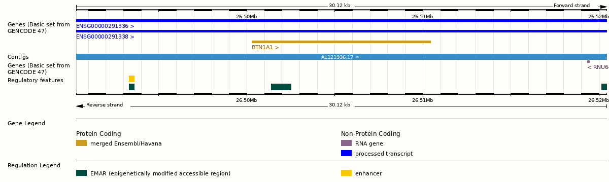

# GenVisR


## Introduction to dataset


The scientists conducted a genome-wide association study and found mutations in specific regions of the genome that correlate with educational attainment. Found mutations are responsible for only two percent of the variation in the level of education and cognitive ability, but include “promising” for further research single-nucleotide polymorphisms (single-nucleotide polymorphisms, SNPs). Specifically, three independent mutations (rs9320913, rs11584700, rs4851266) are responsible for approximately 1 additional month of learning each.[@rietveldGWAS126559Individuals2013].

Studies were performed on data from Utah residents with Northern and Western European ancestry ([@rietveldGWAS126559Individuals2013]).

Daset comes form Supplementary Materials for
GWAS of 126,559 Individuals Identifies Genetic Variants Associated
with Educational Attainment  https://www.science.org/doi/abs/10.1126/science.1235488
(Appendix)


<object data="genVizR/docs/appendix.pdf" type="application/pdf" width="100%" height="750px">
  <embed src="genVizR/docs/appendix.pdf">
  </object>


The normal functioning of each cell depends on thousands of proteins that need to be
to be in the right place at the right time. Sometimes mutations in genes prevent one or
one or more proteins from working properly. By making a change in a gene, the mutation thereby  changes the instructions for synthesizing the protein so that the protein no longer functions  properly or is not synthesized at all.The sequence of a gene in DNA can be altered in several ways. Mutations in  genes have different effects on health and depend on which genes they occurred in and whether the function of these proteins is altered.
This type of Missense mutation is caused by the replacement of one
 DNA base for another (e.g., replacing T for C, or G for A), resulting in the substitution of one amino
 acid for another in the protein encoded by the gene. Here is one example
 of missene mutation from the study by Flint and Munafò[@rietveldGWAS126559Individuals2013]. 


The mutation caused by the substitution of nucleotide A for G results in the substitution of amino acid Aspartic acid for Glutamic acid.This in turn changes the properties of the protein.
 As Whole-Genom scientists have shown the mutation rs1056667 is  associated with cognitive performance
[@eriksonWholeGenomeSequencingHealthy2016]
Gene BTN1A1 is located on chromosome 6[@GeneBTN1A1ENSG00000124557].Some studies have shown that this chromosome is important in the development of normal intelligence[@Chromosome6Ring]. 


```{r, out.width = "780px", fig.cap = "Figure 2. Gene map BTN1A1", message=FALSE, warning=FALSE,}

```


## Implementation  genVizR

<h3>  Genomic Visualization and Interpretations Introduction to  genVizR  </h3>

genVizR is a package to  interpret  and visualize data received from NGS sequencing.There are many tools available for the analysis and visualization of these data. In this module we will focus on 
3 functions : waterfall, genCov, and cnSpec. For the last module another dataset is used. 
The dataset for the spectrum plot comes from the GDC data portal,  https://portal.gdc.cancer.gov/analysis_page?app=Downloads, file with name  MATZO_p_TCGAb40_SNP_1N_GenomeWideSNP_6_E09_667812.grch38.seg.v2.txt.

<h4> Waterfall plots</h4>

The waterfall() function from the genVizR package displays mutation  in a heatmap-like structure with rows and columns denotating genes and samples.The function creates a plot of the mutational landscape from original data. [@WaterfallFunctionIntroduction]

First of all, we need to load the genVizR library from bioconductor. We also need to load the mutation data. In the original dataset, only the gene name, mutation and position are present. We need to
add some additional information from the Ensemble database, such as chromosome coordinates and gene annotation and to join this information to dataset.Output of this function is a heatmap with number (%) of SNP mutations per genes. In this dataset we encure Missense, Silent, Deletion and 3'-UTR mutation


Install required libraries


```{r, eval=FALSE, warning=FALSE, message=FALSE}

if (!requireNamespace("BiocManager", quietly = TRUE))
  install.packages("BiocManager")
BiocManager::install("GenVisR")

```


```{r, warning=FALSE, message=FALSE}

library(GenVisR) 
library(data.table)
library (tidyverse)
library(biomaRt)
library(tidyverse)
```


Data preproccesing. First we save  all  gene names from article to the list.


```{r preprocess}
list_gen_names <- c("AFF3","BTN1A1", "H2AC6", "HMGN4", "MDM4", "LRRN2", "TANK" )
list_ensemble <- c("ENSG00000144218", "ENSG00000124557","ENSG00000180573", "ENSG00000182952", "ENSG00000198625","ENSG00000170382", "ENSG00000136560")
```


Then we need  to retrieve genomic coordinates and annotations for the further analyses. This is possible with biomaRt Bioconductor library

```{r use_mart}

ensembl <- useMart("ensembl")
ensembl <- useDataset("hsapiens_gene_ensembl",mart=ensembl)
object_results2 <-  getBM(attributes=c('ensembl_gene_id','chromosome_name', 'start_position', 'end_position','gene_biotype','hgnc_symbol'),
      filters='hgnc_symbol',
      values=list_gen_names,
      mart=ensembl)  
```
Export Ensemble results to csv file.


```{r results_mart, eval=FALSE}

object_results2
write.csv(object_results2 ,"data_raw/genViz/output_object_results_mart.csv")

```

```{r biomart_results}
knitr::kable(object_results2,
             caption = "The biomart results cotaining the gene coordinates")
```


```{r export_biomarts}
biomart_export <-read.csv("output/genViz/output_object_results_mart.csv") 
```

Join dataset export from biomart with list of genes/mutations.


```{r except_1_col}
biomart_export <- biomart_export[,-1]
head( biomart_export)
```


```{r}
data_set_appendix<-read.csv2("output/genViz/output_BTN1A2.csv")
```

Make column names fit to join the ensemble dataset


```{r recname_cols}
names(data_set_appendix)[names(data_set_appendix) == 'Hugo_Symbol'] <- 'hgnc_symbol'
names(data_set_appendix)[names(data_set_appendix) == 'X'] <- 'sample'

```

```{r  join_data}
full_join <-  merge(data_set_appendix,biomart_export,  by ="hgnc_symbol") 
head(full_join)
```


SNP mutation  in the genome, such as single nucleotide variants, insertions, or deletions, play a significant role in the development of genetic diseases. Identifying and summarizing these variants is frequently the initial stage in forming hypotheses about how these events contribute to the development and advancement of diseases. The purpose of the waterfall function is to effectively consolidate small variant (SNVs/indels) data at a cohort level.  It is usefull  for gaining a comprehensive understanding of the types of variations seen in a group. Additionally, waterfall plots provide insight into the burden of mutations, genes that are frequently mutated, the mutual exclusivity or co-occurrence of genes, and the correlation between variants and clinical information. [@WaterfallFunctionIntroduction]


<h6> waterfall: function implementation on the chosen dataset  </h6>


```{r hierachy, warning=FALSE, message=FALSE}
myHierarchy <- data.table("mutation"=c("Missense_Mutation", "Silent", "3’UTR", "DEL"), color=c("#001ca4", "#A8F5C2",
                                                                     "#D69C4E", "#F4CCD0" ) )

colnames(full_join)

names(full_join)[names(full_join) == 'hgnc_symbol'] <- 'gene'
names(full_join)[names(full_join) == 'Variant_Classification'] <- 'mutation'
names(full_join)[names(full_join) == 'X'] <- 'sample'

full_join <-  full_join  %>%  janitor :: clean_names()


plotGenes=c("PIK3CA", "TP53", "USH2A", "MLL3", "BRCA1")

plotData2 <- Waterfall(full_join, mutationHierarchy = myHierarchy)
```


```{r draw_plot, warning=FALSE, message=FALSE}

drawPlot(plotData2)
```


<h3> cnSpec</h3>

Copy number spectrum plots  generates sequencing data is the the determination of copy number gains and losses.  The cnSpec() function, short for “copy number spectrum”, from the GenVisR package  provides a view of copy number calls for a cohort of cases. 
 Function cnSpec()  requires  parameters are a data frame with column names “chromosome”, “start”, “end”, “segmean”, “sample” and a reference assembly to the parameter genome.The data we will be working is gedownload from GDC database https://portal.gdc.cancer.gov/analysis_page?app=Downloads
 The output of this program consists of a file containing segmented copy number calls. 
 The function gives a visualization of the sequencing dataset by sample by chromosome. Chromosomes are indicated in columns, samples in rows. Red color means too many copies of this gene, which means that these genes are carcinogenic.
 
```{r, warning=FALSE, message=FALSE}

library(GenVisR)
library(tidyverse)
```


```{r raw_data_matzo_genome_grch38, warning=FALSE, message=FALSE}


file_ngs_part1 <-  "data_raw/genViz/MATZO_p_TCGAb40_SNP_1N_GenomeWideSNP_6_E09_667812.grch38.seg.v1.txt"
file_ngs_part2 <- "data_raw/genViz/MATZO_p_TCGAb40_SNP_1N_GenomeWideSNP_6_E09_667812.grch38.seg.v2.txt"

ngs_v1 <-  readr::read_delim(file_ngs_part1, delim = "\t")
ngs_v2 <-  readr::read_delim(file_ngs_part2, delim = "\t")
```


```{r , warning=FALSE, message=FALSE}
ngsv1.2 <-   rbind(ngs_v1,ngs_v2)
head(ngsv1.2)
colnames(ngsv1.2) <- c("sample", "chromosome",  "start", "end", "probes", "segmean")
ngsv1.2  <-  mutate(ngsv1.2, sample=str_sub(sample, start=32, end=36))
```

```{r , warning=FALSE, message=FALSE}
genomeBoundaries <- aggregate(chromEnd ~ chrom, data=cytoGeno[cytoGeno$genome=="hg38",], max)
genomeBoundaries$chromStart <- 0
colnames(genomeBoundaries) <- c("chromosome", "end", "start")

```


```{r,  out.width="100%", warning=FALSE, message=FALSE}

cnSpec(ngsv1.2, genome="hg38",  CN_Loss_colour = "#add8e6",
       CN_Gain_colour = "#A30000", CNscale="relative",  y=genomeBoundaries )
```


<h3> Gen cov </h3>

 Gencov  is the function to view coverage of a specific region of the genome in the context of specific samples. This dataset contains coordinates of 2 gens, BTN1A1, BTN2A1 on the
 chromosome 6 and number their transcripts per coordinate.In this particular plot
 we can see, that BTN1A1 is more covered than  BTN2A1. And we can see the region with  hight and low GC content,  the GC-content is higher in exons than in introns. The second segment of the
 plot with hight CG- content is exon. For this function we need BSgenome object. The BSgenome class is a container for storing the full genome sequences of a given organism. The coverage data for our experiment corresponds to the hg19  reference assembly. Libraries BSgenome.Hsapiens.UCSC.hg19  and TxDb.Hsapiens.UCSC.hg19.knownGene ares loaded.
 


```{r , warning=FALSE, message=FALSE}
library(TxDb.Hsapiens.UCSC.hg19.knownGene)
txdb <- TxDb.Hsapiens.UCSC.hg19.knownGene
library(BSgenome.Hsapiens.UCSC.hg19)
genome <- BSgenome.Hsapiens.UCSC.hg19
```


```{r}
library(BSgenome.Hsapiens.UCSC.hg19)
library(TxDb.Hsapiens.UCSC.hg19.knownGene)
```


```{r, warning=FALSE, message=FALSE}
url <-  "data_raw/genViz/BTN1A1_cov_chr6.V1.txt"

covData <- read.csv(url, sep="\t", header=T)

colnames(covData) <- c("chromosome", "start", "end", "BTN1A1", "BTN2A1")

# create a function to split the data frame into lists of data frames
samples <- c("BTN1A1", "BTN2A1")

```


```{r, warning=FALSE, message=FALSE}
a <- function(x, y){
  col_names <- c("chromosome", "end", x)
  y <- y[,col_names]
  colnames(y) <- c("chromosome", "end", "cov")
  return(y)
}
covData <- lapply(samples, a, covData)

names(covData) <- samples

```

```{r, warning=FALSE, message=FALSE}
genomeObject <-BSgenome.Hsapiens.UCSC.hg19
TxDbObject <- TxDb.Hsapiens.UCSC.hg19.knownGene
```


```{r, warning=FALSE, message=FALSE}
chromosome <- as.character(unique(covData[[1]]$chromosome))
start <- as.numeric(min(covData[[1]]$end))
end <- as.numeric(max(covData[[1]]$end))

```


```{r, warning=FALSE, message=FALSE}
grObject <- GRanges(seqnames=c("chr6"), ranges=IRanges(start=start, end=end))

```


```{r, warning=FALSE, message=FALSE}
genCov(x=covData, txdb=TxDbObject, gr=grObject, genome=genomeObject, cov_plotType="line", label_txtSize = 5)
```


<h4> Bibliography  </h4>

<div id="refs"></div>

