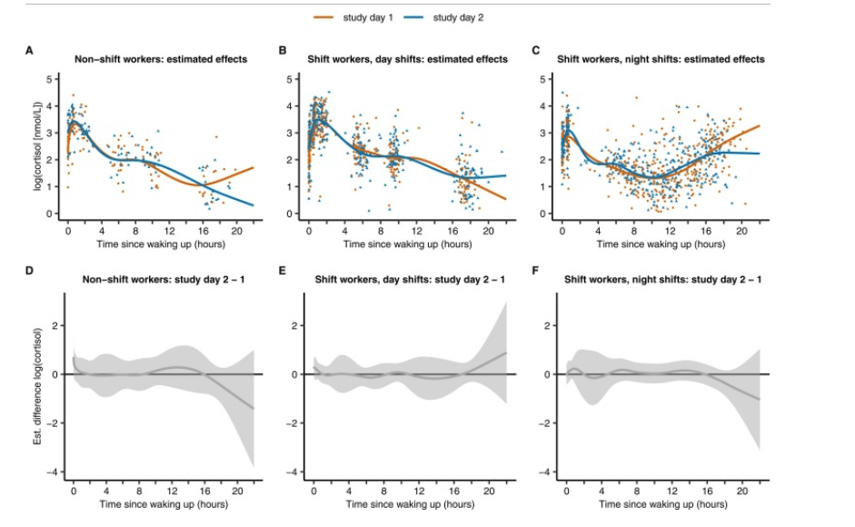

--- 
title: "Data science for biology"
author: "alena savachenko"
date: "`r Sys.Date()`"
site: bookdown::bookdown_site
bibliography: bib/min_seq.bib
csl: assets/apa.csl


output: 
  bookdown::gitbook:
    css: assets/css/style.css
    includes:
      after_body: assets/html/after.html 
    config:
      toc:
        before: |
          <li class="toc-logo"><a href="./"></a></li>
          <li><a href="./">Data science for biology </a></li>

      
---

# Introduction

<div class= "pd22">

This is a  bookdown  written in Markdown for educational purposes inside the course
Data science for biology (TLSC-DSFB26V-20). This portfolio covers reproducible science, version control, sharing code and data in different ways, collaboration, database. Portfolio assignment 
starts with t CV.

</div>


<h3> Portfolio  assignment 1.1 CV </h3>

````{=html}
```{r, echo=FALSE, results='asis'}
xfun::file_string('assets/html/cv_index.html')
```
````


<!--chapter:end:index.Rmd-->

# Portfolio assignment 1.2   Looking ahead

##  Portfolio assignment 1.2 Part 1

<div class="azure">
<h4> Looking ahead</h4>
<h3>  Answer the following questions:  </h3>

<li>  Where do I want to be in ~2 years time? </li>
<li>  How am I doing now with respect to this goal?  </li>
<li>  What would be the next skill to learn? </li>

</div>


<h3> Plan  to get a paid job in the Netherlands </h3>

To do this I need to take the following steps: 
<p> master the Dutch language, get a basic education. </p>
<p>In my final year of education I plan to do an internship at inspection company NAK ( Randweg 14,Emmeloord). Presumably I will be doing work on detecting infection in potato seeds, using qPCR and data analyse of results. </p>

<p>The current course TLSC-DSFB26V-20 is aimed at obtaining basic bio-medical and bioinformatics knowledge, which I need for your work position. <p>
</div>

<h3> What would be the next skill to learn </h3>

<li> -Genomic Data Visualization and Interpretation (Ensemble, UCSC, IGV) </li>
<li> -Visualize mutation profile patterns (GenVisR) </li>
<li> -Visualize the genomic characterization of disease and response to therapy results (GenVisR) </li>
<li> -Matplotlib & Seaborn PyData  </li>


<div class="azure pd22"> Make a planning on how to start learning this new skill.

Note the following points:

    It has to be life sciences or useful for life sciences (no knitting, riding horses etc)
    It has to be data science / bioinformatics
    You have to show your plan in your portfolio, together with the result of the first few steps you took in trying to reach this goal.
    You probably won’t learn this skill in a few days. Just get started.

This assignment will show us whether you succeeded in reaching an overview of the field and possibilities in data science for biology</div>


## Portfolio assignment 1.2 Looking ahead. Package GenVisR


<h3> Visualizing genetic Mutations  with GenVisr  </h3>

 <p> * this is the first approach. The extended analyse follows.


<div class="pd22">

```{r mutation_viz, echo=FALSE}


library(GenVisR)
library(data.table)

mutation_data <-  fread("data/mutation_data.tsv")

mutation_data <- mutation_data[,c('patient', 'gene name','trv type','amino acid change')]

setnames(mutation_data, c("sample", "gene", "mutation", "aminoacid change"))

myHierarchy <- data.table("mutation"=c("nonsense",
                                       "frame_shift_del", "frame_shift_ins", "in_frame_del",
                                       "splice_site_del", "splice_site", "missense",
                                       "splice_region", "rna"), color=c("#FF0000", "#00A08A",
                                                                        "#F2AD00", "#F98400", "#5BBCD6", "#046C9A", "#D69C4E",
                                                                        "#000000", "#446455"))

plotData <- Waterfall(mutation_data, mutationHierarchy = myHierarchy)

```

</div>


```{r waterfall_plot}


drawPlot(plotData)


```

<h3> visualization cancerogenic gene  PIK3CA  </h3>

</br>
</br>


```{r mutation_gen_PIK3CA, echo=FALSE, warning=FALSE, message=FALSE}

library("g3viz")

mutation_gene_hugo <- "PIK3CA"

mutation.csv <- system.file("extdata", "ccle.csv", package = "g3viz")


mutation.dat <- readMAF(mutation.csv,
                        gene.symbol.col = "Hugo_Symbol",
                        variant.class.col = "Variant_Classification",
                        protein.change.col = "amino_acid_change",
                        sep = ",")  # column-separator of csv file


plot.options <- g3Lollipop.options(
  # Chart settings
  chart.width = 600,
  chart.type = "pie",
  chart.margin = list(left = 30, right = 20, top = 20, bottom = 30),
  chart.background = "#d3d3d3",
  transition.time = 300,
  # Lollipop track settings
  lollipop.track.height = 200,
  lollipop.track.background = "#d3d3d3",
  lollipop.pop.min.size = 1,
  lollipop.pop.max.size = 8,
  lollipop.pop.info.limit = 5.5,
  lollipop.pop.info.dy = "0.24em",
  lollipop.pop.info.color = "white",
  lollipop.line.color = "#a9A9A9",
  lollipop.line.width = 3,
  lollipop.circle.color = "#ffdead",
  lollipop.circle.width = 0.4,
  lollipop.label.ratio = 2,
  lollipop.label.min.font.size = 12,
  lollipop.color.scheme = "dark2",
  highlight.text.angle = 60,
  # Domain annotation track settings
  anno.height = 16,
  anno.margin = list(top = 0, bottom = 0),
  anno.background = "#d3d3d3",
  anno.bar.fill = "#a9a9a9",
  anno.bar.margin = list(top = 4, bottom = 4),
  domain.color.scheme = "pie5",
  domain.margin = list(top = 2, bottom = 2),
  domain.text.color = "white",
  domain.text.font = "italic 8px Serif",
  # Y-axis label
  y.axis.label = "# of PIK3CA gene mutations",
  axis.label.color = "#303030",
  axis.label.alignment = "end",
  axis.label.font = "italic 12px Serif",
  axis.label.dy = "-1.5em",
  y.axis.line.color = "#303030",
  y.axis.line.width = 0.5,
  y.axis.line.style = "line",
  y.max.range.ratio = 1.1,
  # Chart title settings
  title.color = "#303030",
  title.text = "PIK3CA gene (customized chart options)",
  title.font = "bold 12px monospace",
  title.alignment = "start",
  # Chart legend settings
  legend = TRUE,
  legend.margin = list(left=20, right = 0, top = 10, bottom = 5),
  legend.interactive = TRUE,
  legend.title = "Variant classification",
  # Brush selection tool
  brush = TRUE,
  brush.selection.background = "#F8F8FF",
  brush.selection.opacity = 0.3,
  brush.border.color = "#a9a9a9",
  brush.border.width = 1,
  brush.handler.color = "#303030",
  # tooltip and zoom
  tooltip = TRUE,
  zoom = TRUE
)


```

```{r amino_acid_mutation_plot}

g3Lollipop(mutation.dat,
           gene.symbol = mutation_gene_hugo,
           protein.change.col = "amino_acid_change",
           btn.style = "blue", # blue-style chart download buttons
           plot.options = plot.options,
           output.filename = "customized_plot")
```


<p> </p>

<div class="pd22">
GenVisR is  focused on supporting of genomic visualizations. The library waterfall of GenViSR answers the question  what mutations are present in the sample. This type plot displays  in a heatmap-like structure with rows and columns denotating genes and samples. </div>


The goal is to investigate Bioconductor package GenVisR and to apply it on a clinical dataset. The plan is to  conduct deeper research on  GenVisR, develop new data analysis techniques, and make contributions to the fields of mutational study in  biology and medicine.
</p>

<p> Dataset supposed to come from Ensemble  database


<!--chapter:end:01-looking_ahead_assign01.Rmd-->

# The Guerrilla Data_management Principles 

##  Portfolio assignment 1.2 Part 1

<div class="azure">
<h4> Looking ahead</h4>
<h3>  Answer the following questions:  </h3>

<li>  Where do I want to be in ~2 years time? </li>
<li>  How am I doing now with respect to this goal?  </li>
<li>  What would be the next skill to learn? </li>

</div>


<h3> Plan  to get a paid job in the Netherlands </h3>

To do this I need to take the following steps: 
<p> master the Dutch language, get a basic education. </p>
<p>In my final year of education I plan to do an internship at inspection company NAK ( Randweg 14,Emmeloord). Presumably I will be doing work on detecting infection in potato seeds, using qPCR and data analyse of results. </p>

<p>The current course TLSC-DSFB26V-20 is aimed at obtaining basic bio-medical and bioinformatics knowledge, which I need for your work position. <p>
</div>

<h3> What would be the next skill to learn </h3>

<li> -Genomic Data Visualization and Interpretation (Ensemble, UCSC, IGV) </li>
<li> -Visualize mutation profile patterns (GenVisR) </li>
<li> -Visualize the genomic characterization of disease and response to therapy results (GenVisR) </li>
<li> -Matplotlib & Seaborn PyData  </li>


<div class="azure pd22"> Make a planning on how to start learning this new skill.

Note the following points:

    It has to be life sciences or useful for life sciences (no knitting, riding horses etc)
    It has to be data science / bioinformatics
    You have to show your plan in your portfolio, together with the result of the first few steps you took in trying to reach this goal.
    You probably won’t learn this skill in a few days. Just get started.

This assignment will show us whether you succeeded in reaching an overview of the field and possibilities in data science for biology</div>


## Portfolio assignment 1.2 Looking ahead. Package GenVisR


<h3> Visualizing genetic Mutations  with GenVisr  </h3>

 <p> * this is the first approach. The extended analyse follows.


<div class="pd22">

```{r mutation_viz, echo=FALSE}


library(GenVisR)
library(data.table)

mutation_data <-  fread("data/mutation_data.tsv")

mutation_data <- mutation_data[,c('patient', 'gene name','trv type','amino acid change')]

setnames(mutation_data, c("sample", "gene", "mutation", "aminoacid change"))

myHierarchy <- data.table("mutation"=c("nonsense",
                                       "frame_shift_del", "frame_shift_ins", "in_frame_del",
                                       "splice_site_del", "splice_site", "missense",
                                       "splice_region", "rna"), color=c("#FF0000", "#00A08A",
                                                                        "#F2AD00", "#F98400", "#5BBCD6", "#046C9A", "#D69C4E",
                                                                        "#000000", "#446455"))

plotData <- Waterfall(mutation_data, mutationHierarchy = myHierarchy)

```

</div>


```{r waterfall_plot}


drawPlot(plotData)


```

<h3> visualization cancerogenic gene  PIK3CA  </h3>

</br>
</br>


```{r, echo=FALSE, warning=FALSE, message=FALSE}

library("g3viz")

mutation_gene_hugo <- "PIK3CA"

mutation.csv <- system.file("extdata", "ccle.csv", package = "g3viz")


mutation.dat <- readMAF(mutation.csv,
                        gene.symbol.col = "Hugo_Symbol",
                        variant.class.col = "Variant_Classification",
                        protein.change.col = "amino_acid_change",
                        sep = ",")  # column-separator of csv file


plot.options <- g3Lollipop.options(
  # Chart settings
  chart.width = 600,
  chart.type = "pie",
  chart.margin = list(left = 30, right = 20, top = 20, bottom = 30),
  chart.background = "#d3d3d3",
  transition.time = 300,
  # Lollipop track settings
  lollipop.track.height = 200,
  lollipop.track.background = "#d3d3d3",
  lollipop.pop.min.size = 1,
  lollipop.pop.max.size = 8,
  lollipop.pop.info.limit = 5.5,
  lollipop.pop.info.dy = "0.24em",
  lollipop.pop.info.color = "white",
  lollipop.line.color = "#a9A9A9",
  lollipop.line.width = 3,
  lollipop.circle.color = "#ffdead",
  lollipop.circle.width = 0.4,
  lollipop.label.ratio = 2,
  lollipop.label.min.font.size = 12,
  lollipop.color.scheme = "dark2",
  highlight.text.angle = 60,
  # Domain annotation track settings
  anno.height = 16,
  anno.margin = list(top = 0, bottom = 0),
  anno.background = "#d3d3d3",
  anno.bar.fill = "#a9a9a9",
  anno.bar.margin = list(top = 4, bottom = 4),
  domain.color.scheme = "pie5",
  domain.margin = list(top = 2, bottom = 2),
  domain.text.color = "white",
  domain.text.font = "italic 8px Serif",
  # Y-axis label
  y.axis.label = "# of PIK3CA gene mutations",
  axis.label.color = "#303030",
  axis.label.alignment = "end",
  axis.label.font = "italic 12px Serif",
  axis.label.dy = "-1.5em",
  y.axis.line.color = "#303030",
  y.axis.line.width = 0.5,
  y.axis.line.style = "line",
  y.max.range.ratio = 1.1,
  # Chart title settings
  title.color = "#303030",
  title.text = "PIK3CA gene (customized chart options)",
  title.font = "bold 12px monospace",
  title.alignment = "start",
  # Chart legend settings
  legend = TRUE,
  legend.margin = list(left=20, right = 0, top = 10, bottom = 5),
  legend.interactive = TRUE,
  legend.title = "Variant classification",
  # Brush selection tool
  brush = TRUE,
  brush.selection.background = "#F8F8FF",
  brush.selection.opacity = 0.3,
  brush.border.color = "#a9a9a9",
  brush.border.width = 1,
  brush.handler.color = "#303030",
  # tooltip and zoom
  tooltip = TRUE,
  zoom = TRUE
)


```

```{r}

g3Lollipop(mutation.dat,
           gene.symbol = mutation_gene_hugo,
           protein.change.col = "amino_acid_change",
           btn.style = "blue", # blue-style chart download buttons
           plot.options = plot.options,
           output.filename = "customized_plot")
```


<p> </p>

<div class="pd22">
GenVisR is  focused on supporting of genomic visualizations. The library waterfall of GenViSR answers the question  what mutations are present in the sample. This type plot displays  in a heatmap-like structure with rows and columns denotating genes and samples. </div>


The goal is to investigate Bioconductor package GenVisR and to apply it on a clinical dataset. The plan is to  conduct deeper research on  GenVisR, develop new data analysis techniques, and make contributions to the fields of mutational study in  biology and medicine.
</p>

<p> Dataset supposed to come from Ensemble  database

## Planing for portfolio assignment 1.2 Looking ahead. Package GenVisR

day 1 : general information and introduction , search for dataset
day 2 and 3 : own implementation of pakcage on the chosen dataset
day 4 :  the repair of bugs and runing the application

day 1,2,3 can be done at the free-lesson days
day 4 can be done during the holiday 

<!--chapter:end:01-The_Guerrilla_Data_management_Principles.Rmd-->

# Agile collaboration

<div class= "azure"> 


github pages

    Execute the steps explained here (click) to setup a github-pages repository called myname-portfolio or something similar.

NOTE: your github pages will be visible for everyone! Don’t put anything on there you do not want the world to see. Including but not restricted to: your address, e-mail etc, data you have no permission for, code you don’t want anyone to see (your teachers will still be able to see all code in your repo)

Once you have successfully rendered your bookdown to a full website, hosting can be achieved by copying all html files to your Github-pages. The easiest way is to:

    set your repo to private
    add your teachers as collaborators on the repo
    clone your github pages repo
    copy all the html files rendered with bookdown to this folder
    commit and push all changes to your github pages repo. The website will be automatically updated after some time.

Make sure your portfolio looks professional, and flex your Rmarkdown and analysis skills: it is meant to be used with future job applications! (Also, it is part of your grade)

    Put your portfolio on your github pages


</div>


<div class= "pd22"> 

<h4> Links to  github pages/repo : </h4>

[Portfolio source code](https://github.com/alenagrrr3/portfolio_alena_savachenko)
<br>
[Portfolio deployment](https://alenagrrr3.github.io/portfolio_alena_savachenko/)
<br>
[Workflow source code](https://github.com/alenagrrr3/worfklow_ds_2)
<br>
[Workflow deployment](https://alenagrrr3.github.io/worfklow_ds_2/)
<br>

</div>

<!--chapter:end:02-Agile_collaboration.Rmd-->

# Data managment principles


<div class="azure"> 


Applying the Guerrilla analytics framework to your own project.

    Look at your RStudio project that you created for the DAUR-II assignments
    download your folders (not the HUGE datafiles and kraken-database!) and rearrange your project according the Guerilla principles explained above
    for the data… folders: provide only a readme.txt with alle the info you would normally put there + where the data is stored
    Provide study documentation and meta data.
    Use the {fs} package to share a screenshot of your folder tree in your portfolio, look at: for more info on how to use the {fs} package.

hint: you had 3 datasets within the RNAseq project, one of them being the exam project, and 2 datasets within the metagenomics project.

    Now clean up your work environment for this course (workflows) and the parallel course in DSFB2 (projecticum). Set up a folder structure that will accomodate future plans and collaboration on the projecticum. Provide readme-files or comments within the code where needed.

For the projecticum folder, make sure you do this together with your lab partner.

</div>


<h5> The portfolio directory: </h5>

```{r, warning=FALSE, message=FALSE}

library(fs)

```


```{r}

                              
fs::dir_tree("C:/Users/Mijn-PC/Documents/hu_courses/worfklow_ds_2")
```


<h5> The Daur-2 directory: </h5>

```{r}


fs::dir_tree("C:/Users/Mijn-PC/Documents/hu_courses/Daur2")
```


<h5> The projecticum  directory: </h5>

```{r}


fs::dir_tree("C:/Users/Mijn-PC/Documents/hu_courses/projecticum")
```


<h5> The portfolio  directory: </h5>

```{r}


fs::dir_tree("C:/Users/Mijn-PC/Documents/hu_courses/portfolio")
```


Include readme to the projecticum dataset


<object data="assets/vignettes/readme_dataset.pdf" type="application/pdf" width="100%" height="750px">
  <embed src="assets/vignettes/readme_dataset.pdf">
  </object>


<!--chapter:end:03-Data-management-principles.Rmd-->

# Reproducible research

<h3>  C. elegans plate experiment  </h3>

<div class="azure">
<p>Open the file in R, using the {readxl} package.</p>
<p>Inspect the data types of columns RawData, compName and compConcentration. What types would you expect from the experimental description above. Have the data types been correctly assigned during the importing of the data into R </p>

<p> Inspect the data types of columns RawData, compName and compConcentration. What types would you expect from the experimental description above. Have the data types been correctly assigned during the importing of the data into R? </p>
</div>


```{r, warning=FALSE, message=FALSE}

library("readxl") 
library("tidyverse")

file <-  read_excel("data/les3/CE.LIQ.FLOW.062_Tidydata.xlsx")

colnames(file)

head(file)

```


Concentration column is a string, It needs to be converted to numeric


```{r}
file$compConcentration <-  as.numeric(file$compConcentration)
```

<div class="azure">
<p>  Create a graph displaying a scatterplot for the CE.LIQ.FLOW.062_Tidydata.xlsx data, for the different compounds and the varying concentrations. Put the compConcentration on the x-axis, the DataRaw counts on the y-axis and assign a colour to each level in compName. Assign a different symbol (shape =) to each level in the expType variable. Try fixing the labels of the x-axis so that we can read them.
</p>
<p>
When creating the plot under C), what happened with the ordering of the x-axis labels. Explain why this happens. Look at the data-type of the compConcentration column in the data again to find a clue.

Correct this and than look at the graph again. Use a log10 transformation on the x-axis to get a clear graph. Also, add a bit of jitter to the points in the graph so that points are not overlapping (Google “ggplot jitter” if needed). </p>
</div>


```{r, warning=FALSE}


ggplot(file, aes(x = compConcentration, y = RawData, colour=compName, shape=expType)) +
  geom_point()+
  scale_x_continuous( trans= 'log10')+
    ggtitle(" Scatterplot for the C.Elegance experiment data") 
  
```


<div class="azure">

Fill in: (G) The positive control for this experiments is ….. (H) The negative control for this experiment is …..

    Think about how you would analyze this experiment to learn whether there is indeed an effect of different concentrations on offspring count and whether the different compounds have a different curve (IC50). Write down you analysis as a step-wise plan.

    Normalize the data for the controlNegative in such a way that the mean value for controlNegative is exactly equal to 1 and that all other values are expressed as a fraction thereof. Rerun your graphs with the normalized data.
    Why would you want to take the step under J?

</div>


```{r}

compNamecontrolPositive<-  file$compName[file$expType == "controlPositive"][1] 
compNamecontrolNegative <-  file$compName[file$expType == "controlNegative"][1] 

```

<p> The positive control for this experiments is  `r compNamecontrolPositive` </p>
<p>  The negative control for this experiment is `r compNamecontrolNegative`</p> 


```{r}

controlNegative <- file$RawData[file$expType=="controlNegative"]
controlNegative_scaled <-  scale(controlNegative, center = 1, scale = TRUE)

controlNegative_scaled

mean_controlNegatieve <-  round(mean(controlNegative_scaled))
mean_controlNegatieve

```

<p> mean scaled control Negatieve : `r mean_controlNegatieve`  </p> 


<p>  You would take this step to be able to analyse to analyze numerical values with different range of values and to be able to set them in one plot </p> 

<p> IC50 curve steps: </p>

<p> 
1. Create a scatter plot of your data, with the x-axis representing the drug concentration and the y-axis representing the percentage of inhibition.

2. Add a trendline to the scatter plot by right-clicking on a data point and selecting "Add Trendline."

3. In the Trendline options, select "Logarithmic" as the Trendline type.

4. Check the box next to "Display Equation on the chart" and "Display R-squared value on chart."

5. The equation that appears on the chart represents the logarithmic curve that fits your data. Use this equation to calculate the IC50 value by solving for the x-value when the y-value equals 50%.

6. To do this, set the equation equal to 50 and solve for x. You can use Excel's solver function or simply trial-and-error to find the x-value that corresponds to a y-value of 50%.

7. The x-value you find is the IC50 value for your drug.

</p>


<!--chapter:end:04-Reproducible_Research.Rmd-->

# Reproducibility issues in a scientific publication. 


<h3>  Open Peer Review scientific publication.Part1 </h3>


<div class="azure">

<p> PART 1 To complete part 1, execute activity A to G 

Initiate an empty RMarkdown file in your RStudio environment and provide author and title (after the title of this exercise)
 Search for a primary Open Access article on one of the above listed topics, using Pubmed Central
    Read the article diagonally (“blader het even door”) to check if is indeed a primary article describing emperical scientific findings.
    Include the reference to this article in your Rmd file
    Score the article on the basis of the above ‘Repita’ criteria
    Write an Rmarkdown report on your findings, including the table above and some information about the article such as general aim, short methods and results. If data is available, try including some
    Store the source Rmd and knitted HTML in a folder called ‘Rmd’ in your course RStudio project. You will need it again later in the course  </p>

</div>


[Reference to this article:  https://pubmed.ncbi.nlm.nih.gov/38723404:]("https://pubmed.ncbi.nlm.nih.gov/38723404/)

<h3> General informtaion  : </h3>

<p>  <strong> Title: </strong>  Altered coordination between sleep timing and cortisol profiles in night working female hospital employees </p>

<p> <strong>   Authors:  </strong>  Katarzyna Burek, Sylvia Rabstein, Thomas Kantermann, Céline Vetter </p>

<h3> Criteria for reproduciblity  scores  : </h3>

<p> <strong>  Study Purpose:  </strong>   The purpose of this study is to measure the cortisol response in shift workers who work night shifts and to compare the cortisol level with non-shift workers.</p>
<p> Binary : Yes </p>
<strong> Data Availability Statement: </strong>  <p> only part of data is available </p> 
<p> Binary : No </p>

<strong>  Data Location: </strong>  <p> Found value: the part of processed data is present in the article as a part of table or graphs. There is no separately data-set available. </p>

<strong> Study Location  </strong>    <p> Hospital Bergmannsheil Bochum, Germany </p>
<p> Binary : Yes </p>
<p> Found location : Hospital Bergmannsheil Bochum, Germany </p>

<strong>  Author Review, Electronic address:  </strong>  <p> Institute for Prevention and Occupational Medicine of the German Social Accident Insurance (IPA), Institute of the Ruhr-Universität Bochum, Bochum, Germany, Electronic address: katarzyna.burek@dguv.de.</p> 

<p> Found Value : Electronic address: katarzyna.burek@dguv.de </p>


<strong> Ethics Statement : </strong>    <p>  data such as names and addresses of participants will not be published </p>
<p> Binary : Yes </p>

<strong> Funding Statement:</strong> <p> Our findings indicate altered cortisol profiles in female hospital employees on night shifts. Specifically, cortisol levels were lower at night when higher levels would typically be necessary for work activities, and higher at bedtime after a night shift, when levels should normally be low. </p>
<p> Binary : Yes </p>
<strong> Code Availability:  </strong><p> the code is not shared, but the visualization of code is included in the
article </p>
<p> Binary : No </p>

<h3> General aim, short methods and results </h3>

<p> Study of cortisol levels in different groups exposed to different experimental conditions,
including day work, shift-work and night work. The main goal of this research is
how does night work affect cortisol levels, is there a significant difference between regular workers and night shift workers. Salivary cortisol was measured 6 times a day in groups of non shift workers and night shift workers. For each collected saliva sample, the difference between sampling time and both times of waking up was calculated.Log transformed cortisol levels was put in linear model against the time with smooth functions as part of the linear predictor
estimated smooth curves of cortisol for each level of the predictor (day shift, night shift) were estimated with smooth curves, and then the non-linear difference between cortisol curves over time was computed. Smooth curves and their difference is visualized. In the night shift group, there was a sharp increase in cortisol towards the end of the working day. The conclusion
is, that In general, night shift workers had higher cortisol levels than day shift workers</p>

<div class="pd22">



<p class="sm_img"> Figuur 1 Cortisol smooth curves by shift and study day, as well as the differences between study days. Individual salivary cortisol levels (points) and estimated cortisol smooth curves (with 95% simultaneous CI) across time since waking up plotted by study group and study day for (A) non-shift workers on day shifts, (B) shift workers on day shifts, and (C) shift workers on night shifts. Estimated difference and 95% simultaneous CI between study days in (D) non-shift workers on day shifts, (E) shift workers on day shifts, (F) in shift workers on night shifts. The random effects were set to zero. In panels D, E and F, the grey area represents durations of no difference (CI for the estimated difference include zero) between the curves (study day 2 compared to study day 1)</p>

</div>


<!--chapter:end:05-Reproducibility_part_1.Rmd-->

# Reproducble research. Part 2 


<div class="azure">
Choose one of the papers used in this study. Or, using the OSF website, search for R code paper or for instance R code paper AND tags:("COVID-19") and select a project that involves a paper on anything (remotely) related to life sciences.
 Make sure you selected a project that has a dataset and R-code shared in the project environment.
    Have a look at the code. Describe in your own words what the code intents to achieve.
    In terms of readibility of the code, how would you grade (1(very bad)-5(very good)) the code available.
  Download the code and the data to a new RStudio project
    Run the script or code that is available to reproduce at least 1 figure
    When you encounter errors or flaws in the script, try fixing them and record your changes.
    Taken together on a scale from 1 (very hard) to 5 (very easy), how much effort did it take you to reproduce the visualization from the project, report or article
    Generate an RMarkdown script that contains the details on the project you selected, the code you used to create the visualization and your score for reproducibility.

</div>


<h3> Gereral information </h3>

<p> Title : <strong>  Interventions to improve oral vaccine performance in developing countries: a systematic review and meta-analysis </strong> </p>

<p> This dataset contains a systematic review of vaccine performance in developing countries.
The goal of this project is countering the spread of cholera, polio, rota virus in India, Pakistan, South Africa, and other developing countries with the help of a vaccine. The goal of the code
is to visualize increase in diseases, dosis vaccination in countries. The purpose of this study is to identify which countries are under-vaccinated.
</p>

<p> Source: https://osf.io/bemw6/</p>


```{r, echo=FALSE, message=FALSE, warning=FALSE, fig.height=3.5, fig.width=9}
d = read.csv("data/les4/csv/Church_et_al_2018_summary.csv", stringsAsFactors = FALSE)
d$Vaccine = as.factor(d$Vaccine)
d$Vaccine = factor(d$Vaccine, levels = c("OCV", "RVV", "OPV"))

library(ggplot2)
ggplot(d, aes(y = RR, x = factor(Intervention), colour = Vaccine, shape = Studies)) + 
  geom_point(aes(size=N), alpha = 0.9) + facet_grid(.~Vaccine) +
  geom_errorbar(aes(ymin=CI_lower, ymax=CI_upper), alpha = 0.5, width=.01) + 
  geom_hline(yintercept = 1, colour="black", linetype="dotted") + 
  scale_shape_manual(values=c(16, 1)) + scale_size(breaks = c(100,500,1000), range = c(1,7)) +
  xlab("") + ylab("Effect size (relative risk)") + scale_y_continuous(trans='log2', limits=c(0.5,4), breaks=c(0.5,1,2,4)) +
  scale_color_manual(values = c("#90B11F", "#D43E55", "#F1A44F")) +
  scale_x_discrete(limits = rev(levels(factor(d$Intervention)))) +
  theme_bw() + coord_flip() + guides(colour=FALSE) + 
  theme(panel.grid.minor = element_blank()) + labs(size = "N subjects", shape = "N studies")
```


```{r, echo=FALSE, message=FALSE, warning=FALSE}
# Load packages required for meta-analysis
library(metafor)
library(forestplot)
library(ggplot2)

# Import data and plot settings
data = read.csv("data/les4/csv/Church_et_al_2018_metaregression_input.csv",header=TRUE, stringsAsFactors=FALSE)
settings = read.csv("data/les4/csv/Church_et_al_2018_plot_settings.csv",header=TRUE, stringsAsFactors=FALSE)

# Select intervention, then subset data
intervention = "Extra dose(s)"
data1 = subset(data, Intervention_category==intervention)

# Replace '--' with '-' characters in age column
data1$Age_formatted = gsub("--", "-", data1$Age_formatted)

# Set plotting parameters for selected intervention (axis limits, plot height, plot width, and footnote coordinates)
forest_x_min_main	= settings[which(settings$intervention==intervention),"forest_x_min_main"]
forest_x_max_main	= settings[which(settings$intervention==intervention),"forest_x_max_main"]
forest_x_min_polio	= settings[which(settings$intervention==intervention),"forest_x_min_polio"]
forest_x_max_polio	= settings[which(settings$intervention==intervention),"forest_x_max_polio"]
plot_width_main	= settings[which(settings$intervention==intervention),"plot_width_main"]
plot_width_polio	= settings[which(settings$intervention==intervention),"plot_width_polio"]
plot_height_main = settings[which(settings$intervention==intervention),"plot_height_main"]
plot_height_polio	= settings[which(settings$intervention==intervention),"plot_height_polio"]
footnote_x_main = settings[which(settings$intervention==intervention),"footnote_x_main"]
footnote_y_main = settings[which(settings$intervention==intervention),"footnote_y_main"]
footnote_x_polio = settings[which(settings$intervention==intervention),"footnote_x_polio"]
footnote_y_polio = settings[which(settings$intervention==intervention),"footnote_y_polio"]
column_gap_main = settings[which(settings$intervention==intervention),"column_gap_main"]

# Create subsets of data for each vaccine target
input_cholera = subset(data1,Vaccine=="Cholera")
input_rota = subset(data1,Vaccine=="Rotavirus")
input_PV1 = subset(data1,Measure_of_SC=="OPV1 N-AB")
input_PV2 = subset(data1,Measure_of_SC=="OPV2 N-AB")
input_PV3 = subset(data1,Measure_of_SC=="OPV3 N-AB")

# Create two collated versions of dataset - one for CV, RV and PV3; one for all types of polio
input_all = rbind(input_cholera, input_rota, input_PV3)
input_PV_all = rbind(input_PV1, input_PV2, input_PV3)

# Set minimum study count for inclusion in meta-analysis
min = 2
```

```{r, echo=FALSE, message=FALSE, warning=FALSE}
# Calculate sums of N by vaccine
cholera_sum = sum(input_all$Total[input_all$Vaccine=="Cholera"])
rota_sum = sum(input_all$Total[input_all$Vaccine=="Rotavirus"])
polio_sum = sum(input_all$Total[input_all$Vaccine=="Polio"])
overall_sum = sum(input_all$Total)

# Calculate number of vaccines included in analysis
n_vaccines = as.numeric(cholera_sum>0) + as.numeric(rota_sum>0) + as.numeric(polio_sum>0)

# Calculate summary statistics for each subset
if (cholera_sum>0) { data_cholera = escalc(measure = "RR", ai = Int_SC_n, bi = Int_N-Int_SC_n, ci = Ctrl_SC_n, di = Ctrl_N-Ctrl_SC_n, data = input_cholera, append = TRUE) }
if (rota_sum>0) { data_rota = escalc(measure = "RR", ai = Int_SC_n, bi = Int_N-Int_SC_n, ci = Ctrl_SC_n, di = Ctrl_N-Ctrl_SC_n, data = input_rota, append = TRUE) }
if (polio_sum>0) { data_PV3 = escalc(measure = "RR", ai = Int_SC_n, bi = Int_N-Int_SC_n, ci = Ctrl_SC_n, di = Ctrl_N-Ctrl_SC_n, data = input_PV3, append = TRUE) }
data_all = escalc(measure = "RR", ai = Int_SC_n, bi = Int_N-Int_SC_n, ci = Ctrl_SC_n, di = Ctrl_N-Ctrl_SC_n, data = input_all, append = TRUE)

# Perform REML meta-analyses
if (cholera_sum>0) { meta_cholera = rma(yi, vi, data = data_cholera, method = "REML") }
if (rota_sum>0) { meta_rota = rma(yi, vi, data = data_rota, method = "REML") }
if (polio_sum>0) { meta_PV3 = rma(yi, vi, data = data_PV3, method = "REML") }

# Perform combined meta-analysis, including random effect on study ID if intervention is 'RVV separated from OPV' (to account for replication of infants for RVV and OPV outcomes)
if (intervention=="RVV separated from OPV") { meta_all = rma.mv(yi, vi, data = data_all, method = "REML", random = ~ 1 | Reference) }
if (intervention!="RVV separated from OPV") { meta_all = rma(yi, vi, data = data_all, method = "REML") }

# Perform mixed-effects meta-regression, including random effect on study ID for 'RVV separated from OPV'
if (nrow(data_all)>=min & n_vaccines>1 & intervention=="RVV separated from OPV") { mixed_all = rma.mv(yi, vi, mods = ~ Vaccine, data = data_all,  method = "REML", random = ~ 1 | Reference) }
if (nrow(data_all)>=min & n_vaccines>1 & intervention!="RVV separated from OPV") { mixed_all = rma(yi, vi, mods = ~ Vaccine, data = data_all,  method = "REML") }
if (n_vaccines==1) {
    mixed_all = NA
    mixed_all$QEp = mixed_all$QMp = 1 } # if there is only 1 vaccine type, assign arbitrary value of 1 to mixed_all p values so as to avoid errors in later logical operators

# Create function to extract RRs and CIs from individual studies in rma meta-analysis output
RR_CIs = function(x) {
    paste0(formatC(round(exp(x$yi),2),format='f',digits=2)," (",formatC(round(exp(x$yi-1.96*sqrt(x$vi)),2),format='f',digits=2),"-",formatC(round(exp(x$yi+1.96*sqrt(x$vi)),2),format='f',digits=2),")")
}

# Create function to extract overall RRs and CIs from rma meta-analysis output
RR_summary = function(x) {
    paste0(formatC(round(exp(x$b),2),format='f',digits=2)," (", formatC(round(exp(x$b-1.96*x$se),2),format='f',digits=2), "-", formatC(round(exp(x$b+1.96*x$se),2),format='f',digits=2),")")
}

# Create function to collate relevant data for each column of forest plot
table_column = function(column_title, ref) {
    column = column_title # specify column title
    if (nrow(input_cholera)>0) { column = c(column,NA,input_cholera[,ref]) } # add study-specific rows if there is at least one study
    if (nrow(input_cholera)<min & nrow(input_cholera)>0) { column = c(column,NA) } # add gap if number of studies is <min
    if (nrow(input_cholera)>=min) { column = c(column,NA,NA) } # add summary row if number of studies is >=min
    
    if (nrow(input_rota)>0) { column = c(column,NA,input_rota[,ref]) }
    if (nrow(input_rota)<min & nrow(input_rota)>0) { column = c(column,NA) }
    if (nrow(input_rota)>=min) { column = c(column,NA,NA) }
    
    if (nrow(input_PV3)>0) { column = c(column,NA,input_PV3[,ref]) }
    if (nrow(input_PV3)<min & nrow(input_PV3)>0) { column = c(column,NA) }
    if (nrow(input_PV3)>=min) { column = c(column,NA,NA) }
    
    if (nrow(input_all)>=min & n_vaccines>1) { column = c(column,NA) }
    if (nrow(input_all)>=min & n_vaccines==1) { column = column[-length(column)] }
    return(column)
}

# Use function to create meta-data columns for forest plot
country = table_column(column_title="Country", ref="Country")
age = table_column(column_title="Age (m)", ref="Age_formatted")
vaccine = table_column(column_title="Vaccine", ref="Vaccine_formatted")
intervention_col = table_column(column_title="Intervention", ref="Intervention_formatted")
N_int = table_column(column_title="n/N (%)", ref="Int_SC_full")
control = table_column(column_title="Control", ref="Control_formatted")
N_ctrl = table_column(column_title="n/N (%)", ref="Ctrl_SC_full")

# Create first column composed of Study IDs and vaccine names
titles = "Study"
if (nrow(input_cholera)>0) { titles = c(titles,"Cholera",input_cholera$Reference) }
if (nrow(input_cholera)<min & nrow(input_cholera)>0) { titles = c(titles,NA) }
if (nrow(input_cholera)>=min) { titles = c(titles,"Summary",NA) }

if (nrow(input_rota)>0) { titles = c(titles,"Rotavirus",input_rota$Reference) }
if (nrow(input_rota)<min & nrow(input_rota)>0) { titles = c(titles,NA) }
if (nrow(input_rota)>=min) { titles = c(titles,"Summary",NA) }

if (nrow(input_PV3)>0) { titles = c(titles,"OPV3",input_PV3$Reference) }
if (nrow(input_PV3)<min & nrow(input_PV3)>0) { titles = c(titles,NA) }
if (nrow(input_PV3)>=min) { titles = c(titles,"Summary",NA) }

if (nrow(input_all)>=min & n_vaccines>1) { titles = c(titles, "Overall") }
if (nrow(input_all)>=min & n_vaccines==1) { titles = titles[-length(titles)] }

# Create final column composed of RRs and 95% CIs
RRs = "RR (95% CI)"
if (nrow(input_cholera)>0) { RRs = c(RRs,NA,RR_CIs(meta_cholera)) }
if (nrow(input_cholera)<min & nrow(input_cholera)>0) { RRs = c(RRs,NA) }
if (nrow(input_cholera)>=min) { RRs = c(RRs,RR_summary(meta_cholera),NA) }

if (nrow(input_rota)>0) { RRs = c(RRs,NA,RR_CIs(meta_rota)) }
if (nrow(input_rota)<min & nrow(input_rota)>0) { RRs = c(RRs,NA) }
if (nrow(input_rota)>=min) { RRs = c(RRs,RR_summary(meta_rota),NA) }

if (nrow(input_PV3)>0) { RRs = c(RRs,NA,RR_CIs(meta_PV3)) }
if (nrow(input_PV3)<min & nrow(input_PV3)>0) { RRs = c(RRs,NA) }
if (nrow(input_PV3)>=min) { RRs = c(RRs,RR_summary(meta_PV3),NA) }

if (nrow(input_all)>=min & n_vaccines>1) { RRs = c(RRs,RR_summary(meta_all)) }
if (nrow(input_all)>=min & n_vaccines==1) { RRs = RRs[-length(RRs)] }

# Collate forest plot text
tabletext = cbind(titles, country, age, vaccine, intervention_col, N_int, control, N_ctrl, RRs)

# Create variable composed of RRs
m = NA
if (nrow(input_cholera)>0) { m = c(m,NA,meta_cholera$yi) }
if (nrow(input_cholera)<min & nrow(input_cholera)>0) { m = c(m,NA) }
if (nrow(input_cholera)>=min) { m = c(m,meta_cholera$b,NA) }

if (nrow(input_rota)>0) { m = c(m,NA,meta_rota$yi) }
if (nrow(input_rota)<min & nrow(input_rota)>0) { m = c(m,NA) }
if (nrow(input_rota)>=min) { m = c(m,meta_rota$b,NA) }

if (nrow(input_PV3)>0) { m = c(m,NA,meta_PV3$yi) }
if (nrow(input_PV3)<min & nrow(input_PV3)>0) { m = c(m,NA) }
if (nrow(input_PV3)>=min) { m = c(m,meta_PV3$b,NA) }

if (nrow(input_all)>=min & n_vaccines>1) { m = c(m,meta_all$b) }
if (nrow(input_all)>=min & n_vaccines==1) { m = m[-length(m)] }

# Create variables for lower CI limits of RR estimates
l = NA
if (nrow(input_cholera)>0) { l = c(l,NA,meta_cholera$yi-sqrt(meta_cholera$vi)*1.96) }
if (nrow(input_cholera)<min & nrow(input_cholera)>0) { l = c(l,NA) }
if (nrow(input_cholera)>=min) { l = c(l,meta_cholera$b-meta_cholera$se*1.96,NA) }

if (nrow(input_rota)>0) { l = c(l,NA,meta_rota$yi-sqrt(meta_rota$vi)*1.96) }
if (nrow(input_rota)<min & nrow(input_rota)>0) { l = c(l,NA) }
if (nrow(input_rota)>=min) { l = c(l,meta_rota$b-meta_rota$se*1.96,NA) }

if (nrow(input_PV3)>0) { l = c(l,NA,meta_PV3$yi-sqrt(meta_PV3$vi)*1.96) }
if (nrow(input_PV3)<min & nrow(input_PV3)>0) { l = c(l,NA) }
if (nrow(input_PV3)>=min) { l = c(l,meta_PV3$b-meta_PV3$se*1.96,NA) }

if (nrow(input_all)>=min & n_vaccines>1) { l = c(l,meta_all$b-meta_all$se*1.96) }
if (nrow(input_all)>=min & n_vaccines==1) { l = l[-length(l)] }

# Create variables for upper CI limits of RR estimates
u = NA
if (nrow(input_cholera)>0) { u = c(u,NA,meta_cholera$yi+sqrt(meta_cholera$vi)*1.96) }
if (nrow(input_cholera)<min & nrow(input_cholera)>0) { u = c(u,NA) }
if (nrow(input_cholera)>=min) { u = c(u,meta_cholera$b+meta_cholera$se*1.96,NA) }

if (nrow(input_rota)>0) { u = c(u,NA,meta_rota$yi+sqrt(meta_rota$vi)*1.96) }
if (nrow(input_rota)<min & nrow(input_rota)>0) { u = c(u,NA) }
if (nrow(input_rota)>=min) { u = c(u,meta_rota$b+meta_rota$se*1.96,NA) }

if (nrow(input_PV3)>0) { u = c(u,NA,meta_PV3$yi+sqrt(meta_PV3$vi)*1.96) }
if (nrow(input_PV3)<min & nrow(input_PV3)>0) { u = c(u,NA) }
if (nrow(input_PV3)>=min) { u = c(u,meta_PV3$b+meta_PV3$se*1.96,NA) }

if (nrow(input_all)>=min & n_vaccines>1) { u = c(u,meta_all$b+meta_all$se*1.96) }
if (nrow(input_all)>=min & n_vaccines==1) { u = u[-length(u)] }
```

<h3> Forest plot </h3>

```{r, echo=FALSE, message=FALSE, warning=FALSE, fig.width=plot_width_main, fig.height=plot_height_main}
# Create function to assign colours to meta-analysis boxes and lines
# Adapted from: https://stackoverflow.com/questions/46938910
fn <- local({
    i = 0
    b_clrs = vector()
    if (nrow(input_cholera)>0) { b_clrs = rep("#90B11F", nrow(input_cholera)) }
    if (nrow(input_rota)>0) { b_clrs = c(b_clrs, rep("#D43E55", nrow(input_rota))) }
    if (nrow(input_PV3)>0) { b_clrs = c(b_clrs, rep("#F1A44F", nrow(input_PV3))) }
    b_clrs = c(b_clrs, "black")
    l_clrs = rep("grey", length(b_clrs))
    # l_clrs = b_clrs # use this line instead of the line above to make lines the same colour as the boxes
    
    function(..., clr.line, clr.marker){
        i <<- i + 1
        fpDrawNormalCI(..., clr.line = l_clrs[i], clr.marker = b_clrs[i])
    }
})

# Create function to assign colours to meta-analysis summary diamonds
# Adapted from: https://stackoverflow.com/questions/46938910
fn_sum <- local({
    i = 0
    b_clrs_sum = vector()
    if (nrow(input_cholera)>=min) { b_clrs_sum = 	"#90B11F" }
    if (nrow(input_rota)>=min) { b_clrs_sum = c(b_clrs_sum, "#D43E55") }
    if (nrow(input_PV3)>=min) { b_clrs_sum = c(b_clrs_sum, "#F1A44F") }
    b_clrs_sum = c(b_clrs_sum, "black")
    function(..., col){
        i <<- i + 1
        fpDrawSummaryCI(..., col = b_clrs_sum[i])
    }
})

# Create forest plot
if (nrow(input_all)>=min) {
    forestplot(tabletext,exp(m),exp(l),exp(u),zero=1,
    is.summary=c(TRUE,TRUE,!is.na(tabletext[3:nrow(tabletext),1]) & (tabletext[3:nrow(tabletext),1]=="Summary" | tabletext[3:nrow(tabletext),1]=="Overall"| tabletext[3:nrow(tabletext),1]=="Cholera"| tabletext[3:nrow(tabletext),1]=="Rotavirus"| tabletext[3:nrow(tabletext),1]=="OPV3")),
    clip=c(forest_x_min_main,forest_x_max_main), xlog=TRUE,
    xticks=c(forest_x_min_main,1,forest_x_max_main),
    fn.ci_norm=fn,
    fn.ci_sum=fn_sum,
    colgap=unit(column_gap_main,"mm"),
    txt_gp = fpTxtGp(ticks = gpar(cex=0.8))
    )
    
    # Add footnote containing heterogeneity results
    if (nrow(data_all)>=min & n_vaccines>1 & mixed_all$QEp>=0.0001) {
        grid.text(paste0("Heterogeneity among vaccines (Qm ", formatC(round(mixed_all$QM,2),format='f',digits=2), ", df ", mixed_all$m, "), p = ", formatC(round(mixed_all$QMp,3),format='f',digits=3),
        "; Residual heterogeneity (Qe ", formatC(round(mixed_all$QE,2),format='f',digits=2), ", df ", mixed_all$k-mixed_all$p, "), p = ", formatC(round(mixed_all$QEp,3),format='f',digits=3)),
        footnote_x_main, footnote_y_main, gp = gpar(fontsize=12, font = "sans")) }
    if (nrow(data_all)>=min & n_vaccines>1 & mixed_all$QEp<0.0001) {
        grid.text(paste0("Heterogeneity among vaccines (Qm ", formatC(round(mixed_all$QM,2),format='f',digits=2), ", df ", mixed_all$m, "), p = ", formatC(round(mixed_all$QMp,3),format='f',digits=3),
        "; Residual heterogeneity (Qe ", formatC(round(mixed_all$QE,2),format='f',digits=2), ", df ", mixed_all$k-mixed_all$p, "), p < 0.0001"),
        footnote_x_main, footnote_y_main, gp = gpar(fontsize=12, font = "sans")) }
    
    if (nrow(data_all)>=min & n_vaccines==1 & meta_all$QEp>=0.0001) {
        grid.text(paste0("Heterogeneity (Q ", formatC(round(meta_all$QE,2),format='f',digits=2), ", df ", meta_all$k-meta_all$p, "), p = ", formatC(round(meta_all$QEp,3),format='f',digits=3)),
        footnote_x_main, footnote_y_main, gp = gpar(fontsize=12, font = "sans")) }
    if (nrow(data_all)>=min & n_vaccines==1 & meta_all$QEp<0.0001) {
        grid.text(paste0("Heterogeneity (Q ", formatC(round(meta_all$QE,2),format='f',digits=2), ", df ", meta_all$k-meta_all$p, "), p < 0.0001"),
        footnote_x_main, footnote_y_main, gp = gpar(fontsize=12, font = "sans")) }
    
} else { print("Insufficient studies (n<2)") }
```

<h3> Funnel plot </h3>

```{r, echo=FALSE, message=FALSE, fig.height=3, fig.width=6}
# Draw funnel plot containing all results included in meta-analysis
overall_estimate = meta_all$b
funnel_input = data.frame(SE = sqrt(meta_all$vi), LogRR = meta_all$yi, Vaccine = input_all$Vaccine, N = input_all$Total)
ggplot(funnel_input, aes(y=SE, x=LogRR)) + geom_point(aes(color = Vaccine), size=3.5, alpha=0.7) +
geom_vline(xintercept=overall_estimate, color='grey', linetype='dashed') + theme_minimal() +
ylab('SE (log RR)') + xlab('log RR') +  scale_y_reverse() + xlim(-2,2) +
scale_color_manual(values = c("Cholera" = "#90B11F", "Polio" = "#F1A44F" , "Rotavirus" =  "#D43E55")) +
theme(legend.title=element_blank(), legend.position="right")
```

<h3> Egger's test </h3>

```{r, echo=FALSE, message=FALSE, warning=FALSE}
# Perform Egger's test; for 'RVV separated from OPV', this should be stratified by vaccine type to account for replication of infants for RVV and OPV outcomes
if (nrow(data_all)<3) { print("Insufficient studies (n<3)") }
if (nrow(data_all)>=3 & intervention!="RVV separated from OPV" & mixed_all$QMp>=0.05) {
    print("No replication of infants across vaccines or significant vaccine effect, therefore combined test performed")
    regtest(meta_all, predictor="sei") }

if (nrow(data_all)>=3 & (intervention=="RVV separated from OPV" | mixed_all$QMp<0.05)) {
    print("Infants replicated across vaccines or vaccine effect significant, therefore separate tests performed")
    print("Cholera:")
    if (nrow(input_cholera)>=3) { print(regtest(meta_cholera, predictor="sei")) } else { print("Insufficient studies (n<3)")}
    print("Rotavirus:")
    if (nrow(input_rota)>=3) { print(regtest(meta_rota, predictor="sei")) } else { print("Insufficient studies (n<3)")}
    print("OPV3:")
    if (nrow(input_PV3)>=3) { print(regtest(meta_PV3, predictor="sei")) } else { print("Insufficient studies (n<3)")}
}
```

<h3> Meta-analysis output </h3>


```{r, echo=FALSE, message=FALSE, warning=FALSE}
if (nrow(input_all)>=min) { summary(meta_all) } else { print("Insufficient studies (n<2)") }
```

<h3> Meta-regression output </h3>
```{r, echo=FALSE, message=FALSE, warning=FALSE}
# If more than one type of vaccine included in analysis, print meta-regression results
if (nrow(data_all)>=min & n_vaccines>1) { mixed_all } else {  print("Insufficient studies for meta-regression (either <2 studies or only 1 vaccine type)") }
```
 
<h3> Intervention-specific outputs </h3>

<h4> Summary of cholera studies </h4>

```{r, echo=FALSE, message=FALSE, warning=FALSE}
if (nrow(input_cholera)>=min) { summary(meta_cholera) } else { print("Insufficient studies (n<2)")}
```

<h4> Summary of rotavirus studies </h4>

```{r, echo=FALSE, message=FALSE, warning=FALSE}
if (nrow(input_rota)>=min) { summary(meta_rota) } else { print("Insufficient studies (n<2)")}
```

<h4> Summary of PV3 studies </h4>

```{r, echo=FALSE, message=FALSE, warning=FALSE}
if (nrow(input_PV3)>=min) { summary(meta_PV3) } else { print("Insufficient studies (n<2)")}
```

<h3> Meta-regression: secondary moderators </h3>

<h4> Age group </h4>
```{r, echo=FALSE, message=FALSE, warning=FALSE}
if (nrow(data_all)>=min & n_vaccines>1) { QEp = mixed_all$QEp }
if (nrow(data_all)>=min & n_vaccines==1) { QEp = meta_all$QEp }

if (QEp>0.05) { print("Residual heterogeneity not significant (p>0.05)")
} else if (nlevels(factor(data_all$Age_group))==1) { print("No variation in moderator among studies")
} else if (nlevels(factor(data_all$Age_group))==nrow(data_all)) { print("Insufficient studies (n studies == n moderators)")
} else if (intervention=="RVV separated from OPV") {
    print("Rotavirus-specific analysis performed owing to absence of significant residual heterogeneity for OPV studies")
    print(table(data_rota$Age_group))
    meteregression_age = rma.mv(yi, vi, mods = ~ factor(Age_group), data = data_rota,  method = "REML")
    meteregression_age
} else if (intervention!="RVV separated from OPV") {
    print(table(data_all$Age_group))
    meteregression_age = rma(yi, vi, mods = ~ factor(Age_group), data = data_all,  method = "REML")
    meteregression_age
}
```

<h4> Income setting </h4>


```{r, echo=FALSE, message=FALSE, warning=FALSE}
if (QEp>0.05) { print("Residual heterogeneity not significant (p>0.05)")
} else if (nlevels(factor(data_all$Income_group))==1) { print("No variation in moderator among studies")
} else if (nlevels(factor(data_all$Income_group))==nrow(data_all)) { print("Insufficient studies (n studies == n moderators)")
} else if (intervention=="RVV separated from OPV") {
    print("Rotavirus-specific analysis performed owing to absence of significant residual heterogeneity for OPV studies")
    print(table(data_rota$Income_group))
    meteregression_setting = rma.mv(yi, vi, mods = ~ factor(Income_group), data = data_rota, method = "REML")
    meteregression_setting
} else if (intervention!="RVV separated from OPV") {
    print(table(data_all$Income_group))
    meteregression_setting = rma(yi, vi, mods = ~ factor(Income_group), data = data_all,  method = "REML")
    meteregression_setting
}
```

<h4> Background immunogenicity (seroconversion rate in the control group)
```{r, echo=FALSE, message=FALSE, warning=FALSE}
if (QEp>0.05) { print("Residual heterogeneity not significant (p>0.05)")
} else if (intervention=="RVV separated from OPV") {
    print("Rotavirus-specific analysis performed owing to absence of significant residual heterogeneity for OPV studies")
    meteregression_baseline = rma.mv(yi, vi, mods = ~ asin(sqrt(Baseline_seroconversion)), data = data_rota,  method = "REML")
    meteregression_baseline
} else if (intervention!="RVV separated from OPV") {
    meteregression_baseline = rma(yi, vi, mods = ~ asin(sqrt(Baseline_seroconversion)), data = data_all,  method = "REML")
    meteregression_baseline
}
```

<h3> OPV-specific analysis </h3>

```{r, echo=FALSE, message=FALSE, warning=FALSE}
# Calculate sums of N by vaccine
PV1_sum = sum(input_PV_all$Total[input_PV_all$Measure_of_SC=="OPV1 N-AB"])
PV2_sum = sum(input_PV_all$Total[input_PV_all$Measure_of_SC=="OPV2 N-AB"])
PV3_sum = sum(input_PV_all$Total[input_PV_all$Measure_of_SC=="OPV3 N-AB"])
overall_PV_sum = sum(input_PV_all$Total)

# Calculate number of vaccines included in analysis
n_PV_vaccines = as.numeric(PV1_sum>0) + as.numeric(PV2_sum>0) + as.numeric(PV3_sum>0)

# Calculate summary statistics for each subset
if (PV1_sum>0) {data_PV1 = escalc(measure = "RR", ai = Int_SC_n, bi = Int_N-Int_SC_n, ci = Ctrl_SC_n, di = Ctrl_N-Ctrl_SC_n, data = input_PV1, append = TRUE) }
if (PV2_sum>0) {data_PV2 = escalc(measure = "RR", ai = Int_SC_n, bi = Int_N-Int_SC_n, ci = Ctrl_SC_n, di = Ctrl_N-Ctrl_SC_n, data = input_PV2, append = TRUE) }
if (PV3_sum>0) {data_PV3 = escalc(measure = "RR", ai = Int_SC_n, bi = Int_N-Int_SC_n, ci = Ctrl_SC_n, di = Ctrl_N-Ctrl_SC_n, data = input_PV3, append = TRUE) }
if (overall_PV_sum>0) {data_PV_all = escalc(measure = "RR", ai = Int_SC_n, bi = Int_N-Int_SC_n, ci = Ctrl_SC_n, di = Ctrl_N-Ctrl_SC_n, data = input_PV_all, append = TRUE) }

# Perform REML meta-analyses
if (PV1_sum>0) { meta_PV1 = rma(yi, vi, data = data_PV1, method = "REML") }
if (PV2_sum>0) { meta_PV2 = rma(yi, vi, data = data_PV2, method = "REML") }
if (PV3_sum>0) { meta_PV3 = rma(yi, vi, data = data_PV3, method = "REML") }

# Perform combined meta-analysis, including random effect on study ID
if (overall_PV_sum>0) { meta_PV_all = rma.mv(yi, vi, data = data_PV_all, method = "REML", random = ~ 1 | Reference) }

# Perform mixed-effects meta-regression, including random effect on study ID
if (nrow(input_PV_all)>=min & n_PV_vaccines>1) { mixed_PV_all = rma.mv(yi, vi, mods = ~ Measure_of_SC, data = data_PV_all,  method = "REML", random = ~ 1 | Reference) }
if (n_PV_vaccines==1) {
    mixed_PV_all = NA
    mixed_PV_all$QEp = mixed_PV_all$QMp = 1 } # if there is only 1 vaccine type, assign arbitrary value of 1 to mixed_all p values so as to avoid errors in later logical operators

# Create function to collate relevant data for each column of PV-specific forest plot
table_column_PV = function(column_title, ref) {
    column = column_title # specify column title
    if (nrow(input_PV1)>0) { column = c(column,NA,input_PV1[,ref]) } # add study-specific rows if there is at least one study
    if (nrow(input_PV1)<min & nrow(input_PV1)>0) { column = c(column,NA) } # add gap if number of studies is <min
    if (nrow(input_PV1)>=min) { column = c(column,NA,NA) } # add summary row if number of studies is >=min
    
    if (nrow(input_PV2)>0) { column = c(column,NA,input_PV2[,ref]) }
    if (nrow(input_PV2)<min & nrow(input_PV2)>0) { column = c(column,NA) }
    if (nrow(input_PV2)>=min) { column = c(column,NA,NA) }
    
    if (nrow(input_PV3)>0) { column = c(column,NA,input_PV3[,ref]) }
    if (nrow(input_PV3)<min & nrow(input_PV3)>0) { column = c(column,NA) }
    if (nrow(input_PV3)>=min) { column = c(column,NA,NA) }
    if (nrow(input_PV_all)>=min & n_PV_vaccines>1) { column = c(column,NA) }
    if (nrow(input_PV_all)>=min & n_PV_vaccines==1) { column = column[-length(column)] }
    return(column)
}

# Use function to create meta-data columns for forest plot
country = table_column_PV(column_title="Country", ref="Country")
age = table_column_PV(column_title="Age (m)", ref="Age_formatted")
vaccine = table_column_PV(column_title="Vaccine", ref="Vaccine_formatted")
intervention_col = table_column_PV(column_title="Intervention", ref="Intervention_formatted")
N_int = table_column_PV(column_title="n/N (%)", ref="Int_SC_full")
control = table_column_PV(column_title="Control", ref="Control_formatted")
N_ctrl = table_column_PV(column_title="n/N (%)", ref="Ctrl_SC_full")

# Create first column composed of Study IDs and vaccine names
titles = "Study"
if (nrow(input_PV1)>0) { titles = c(titles,"OPV1",input_PV1$Reference) }
if (nrow(input_PV1)<min & nrow(input_PV1)>0) { titles = c(titles,NA) }
if (nrow(input_PV1)>=min) { titles = c(titles,"Summary",NA) }

if (nrow(input_PV2)>0) { titles = c(titles,"OPV2",input_PV2$Reference) }
if (nrow(input_PV2)<min & nrow(input_PV2)>0) { titles = c(titles,NA) }
if (nrow(input_PV2)>=min) { titles = c(titles,"Summary",NA) }

if (nrow(input_PV3)>0) { titles = c(titles,"OPV3",input_PV3$Reference) }
if (nrow(input_PV3)<min & nrow(input_PV3)>0) { titles = c(titles,NA) }
if (nrow(input_PV3)>=min) { titles = c(titles,"Summary",NA) }

if (nrow(input_PV_all)>=min & n_PV_vaccines>1) { titles = c(titles, "Overall") }
if (nrow(input_PV_all)>=min & n_PV_vaccines==1) { titles = titles[-length(titles)] }

# Create final column composed of RRs and 95% CIs
RRs = "RR (95% CI)"
if (nrow(input_PV1)>0) { RRs = c(RRs,NA,RR_CIs(meta_PV1)) }
if (nrow(input_PV1)<min & nrow(input_PV1)>0) { RRs = c(RRs,NA) }
if (nrow(input_PV1)>=min) { RRs = c(RRs,RR_summary(meta_PV1),NA) }

if (nrow(input_PV2)>0) { RRs = c(RRs,NA,RR_CIs(meta_PV2)) }
if (nrow(input_PV2)<min & nrow(input_PV2)>0) { RRs = c(RRs,NA) }
if (nrow(input_PV2)>=min) { RRs = c(RRs,RR_summary(meta_PV2),NA) }

if (nrow(input_PV3)>0) { RRs = c(RRs,NA,RR_CIs(meta_PV3)) }
if (nrow(input_PV3)<min & nrow(input_PV3)>0) { RRs = c(RRs,NA) }
if (nrow(input_PV3)>=min) { RRs = c(RRs,RR_summary(meta_PV3),NA) }

if (nrow(input_PV_all)>=min & n_PV_vaccines>1) { RRs = c(RRs,RR_summary(meta_PV_all)) }
if (nrow(input_PV_all)>=min & n_PV_vaccines==1) { RRs = RRs[-length(RRs)] }

# Collate forest plot text
tabletext = cbind(titles, country, age, vaccine, intervention_col, N_int, control, N_ctrl, RRs)

# Create variable composed of RRs
m = NA
if (nrow(input_PV1)>0) { m = c(m,NA,meta_PV1$yi) }
if (nrow(input_PV1)<min & nrow(input_PV1)>0) { m = c(m,NA) }
if (nrow(input_PV1)>=min) { m = c(m,meta_PV1$b,NA) }

if (nrow(input_PV2)>0) { m = c(m,NA,meta_PV2$yi) }
if (nrow(input_PV2)<min & nrow(input_PV2)>0) { m = c(m,NA) }
if (nrow(input_PV2)>=min) { m = c(m,meta_PV2$b,NA) }

if (nrow(input_PV3)>0) { m = c(m,NA,meta_PV3$yi) }
if (nrow(input_PV3)<min & nrow(input_PV3)>0) { m = c(m,NA) }
if (nrow(input_PV3)>=min) { m = c(m,meta_PV3$b,NA) }

if (nrow(input_PV_all)>=min & n_PV_vaccines>1) { m = c(m,meta_PV_all$b) }
if (nrow(input_PV_all)>=min & n_PV_vaccines==1) { m = m[-length(m)] }

# Create variables for lower CI limits of RR estimates
l = NA
if (nrow(input_PV1)>0) { l = c(l,NA,meta_PV1$yi-sqrt(meta_PV1$vi)*1.96) }
if (nrow(input_PV1)<min & nrow(input_PV1)>0) { l = c(l,NA) }
if (nrow(input_PV1)>=min) { l = c(l,meta_PV1$b-meta_PV1$se*1.96,NA) }

if (nrow(input_PV2)>0) { l = c(l,NA,meta_PV2$yi-sqrt(meta_PV2$vi)*1.96) }
if (nrow(input_PV2)<min & nrow(input_PV2)>0) { l = c(l,NA) }
if (nrow(input_PV2)>=min) { l = c(l,meta_PV2$b-meta_PV2$se*1.96,NA) }

if (nrow(input_PV3)>0) { l = c(l,NA,meta_PV3$yi-sqrt(meta_PV3$vi)*1.96) }
if (nrow(input_PV3)<min & nrow(input_PV3)>0) { l = c(l,NA) }
if (nrow(input_PV3)>=min) { l = c(l,meta_PV3$b-meta_PV3$se*1.96,NA) }

if (nrow(input_PV_all)>=min & n_PV_vaccines>1) { l = c(l,meta_PV_all$b-meta_PV_all$se*1.96) }
if (nrow(input_PV_all)>=min & n_PV_vaccines==1) { l = l[-length(l)] }

# Create variables for upper CI limits of RR estimates
u = NA
if (nrow(input_PV1)>0) { u = c(u,NA,meta_PV1$yi+sqrt(meta_PV1$vi)*1.96) }
if (nrow(input_PV1)<min & nrow(input_PV1)>0) { u = c(u,NA) }
if (nrow(input_PV1)>=min) { u = c(u,meta_PV1$b+meta_PV1$se*1.96,NA) }

if (nrow(input_PV2)>0) { u = c(u,NA,meta_PV2$yi+sqrt(meta_PV2$vi)*1.96) }
if (nrow(input_PV2)<min & nrow(input_PV2)>0) { u = c(u,NA) }
if (nrow(input_PV2)>=min) { u = c(u,meta_PV2$b+meta_PV2$se*1.96,NA) }

if (nrow(input_PV3)>0) { u = c(u,NA,meta_PV3$yi+sqrt(meta_PV3$vi)*1.96) }
if (nrow(input_PV3)<min & nrow(input_PV3)>0) { u = c(u,NA) }
if (nrow(input_PV3)>=min) { u = c(u,meta_PV3$b+meta_PV3$se*1.96,NA) }

if (nrow(input_PV_all)>=min & n_PV_vaccines>1) { u = c(u,meta_PV_all$b+meta_PV_all$se*1.96) }
if (nrow(input_PV_all)>=min & n_PV_vaccines==1) { u = u[-length(u)] }
```

<h3> Forest plot </h3>

```{r, echo=FALSE, message=FALSE, warning=FALSE, fig.width=plot_width_polio, fig.height=plot_height_polio}
# Create function to assign colours to meta-analysis boxes and lines
# Adapted from: https://stackoverflow.com/questions/46938910
fn <- local({
    i = 0
    b_clrs = vector()
    if (nrow(input_PV1)>0) { b_clrs = rep("#f1cd4f", nrow(input_PV1)) }
    if (nrow(input_PV2)>0) { b_clrs = c(b_clrs, rep("#734109", nrow(input_PV2))) }
    if (nrow(input_PV3)>0) { b_clrs = c(b_clrs, rep("#F1A44F", nrow(input_PV3))) }
    b_clrs = c(b_clrs, "black")
    l_clrs = rep("grey", length(b_clrs))
    # l_clrs = b_clrs # use this line instead of the line above to make lines the same colour as the boxes
    
    function(..., clr.line, clr.marker){
        i <<- i + 1
        fpDrawNormalCI(..., clr.line = l_clrs[i], clr.marker = b_clrs[i])
    }
})

# Create function to assign colours to meta-analysis summary diamonds
# Adapted from: https://stackoverflow.com/questions/46938910
fn_sum <- local({
    i = 0
    b_clrs_sum = vector()
    if (nrow(input_PV1)>=min) { b_clrs_sum = 	"#f1cd4f" }
    if (nrow(input_PV2)>=min) { b_clrs_sum = c(b_clrs_sum, "#734109") }
    if (nrow(input_PV3)>=min) { b_clrs_sum = c(b_clrs_sum, "#F1A44F") }
    b_clrs_sum = c(b_clrs_sum, "black")
    function(..., col){
        i <<- i + 1
        fpDrawSummaryCI(..., col = b_clrs_sum[i])
    }
})

# Create forest plot
if (nrow(input_PV_all)>=min) {
    forestplot(tabletext,exp(m),exp(l),exp(u),zero=1,
    is.summary=c(TRUE,TRUE,!is.na(tabletext[3:nrow(tabletext),1]) & (tabletext[3:nrow(tabletext),1]=="Summary" | tabletext[3:nrow(tabletext),1]=="Overall"| tabletext[3:nrow(tabletext),1]=="OPV1"| tabletext[3:nrow(tabletext),1]=="OPV2"| tabletext[3:nrow(tabletext),1]=="OPV3")),
    clip=c(forest_x_min_polio,forest_x_max_polio), xlog=TRUE,
    xticks=c(forest_x_min_polio,1,forest_x_max_polio),
    fn.ci_norm=fn,
    fn.ci_sum=fn_sum,
    colgap=unit(5,"mm"),
    txt_gp = fpTxtGp(ticks = gpar(cex=0.8))
    )
    
    # Add footnote containing heterogeneity results
    if (nrow(input_PV_all)>=min & n_PV_vaccines>1 & mixed_PV_all$QEp>=0.0001) {
        grid.text(paste0("Heterogeneity among vaccines (Qm ", formatC(round(mixed_PV_all$QM,2),format='f',digits=2), ", df ", mixed_PV_all$m, "), p = ", formatC(round(mixed_PV_all$QMp,3),format='f',digits=3),
        "; Residual heterogeneity (Qe ", formatC(round(mixed_PV_all$QE,2),format='f',digits=2), ", df ", mixed_PV_all$k-mixed_PV_all$p, "), p = ", formatC(round(mixed_PV_all$QEp,3),format='f',digits=3)),
        footnote_x_polio, footnote_y_polio, gp = gpar(fontsize=12, font = "sans")) }
    if (nrow(input_PV_all)>=min & n_PV_vaccines>1 & mixed_PV_all$QEp<0.0001) {
        grid.text(paste0("Heterogeneity among vaccines (Qm ", formatC(round(mixed_PV_all$QM,2),format='f',digits=2), ", df ", mixed_PV_all$m, "), p = ", formatC(round(mixed_PV_all$QMp,3),format='f',digits=3),
        "; Residual heterogeneity (Qe ", formatC(round(mixed_PV_all$QE,2),format='f',digits=2), ", df ", mixed_PV_all$k-mixed_PV_all$p, "), p < 0.0001"),
        footnote_x_polio, footnote_y_polio, gp = gpar(fontsize=12, font = "sans")) }
    
    if (nrow(input_PV_all)>=min & n_PV_vaccines==1 & meta_PV_all$QEp>=0.0001) {
        grid.text(paste0("Heterogeneity (Q ", formatC(round(meta_PV_all$QE,2),format='f',digits=2), ", df ", meta_PV_all$k-meta_PV_all$p, "), p = ", formatC(round(meta_PV_all$QEp,3),format='f',digits=3)),
        0.1, footnote_y_polio, gp = gpar(fontsize=12, font = "sans")) }
    if (nrow(input_PV_all)>=min & n_PV_vaccines==1 & meta_PV_all$QEp<0.0001) {
        grid.text(paste0("Heterogeneity (Q ", formatC(round(meta_PV_all$QE,2),format='f',digits=2), ", df ", meta_PV_all$k-meta_PV_all$p, "), p < 0.0001"),
        0.1, footnote_y_polio, gp = gpar(fontsize=12, font = "sans")) }
    
} else { print("Insufficient studies (n<2)")}
```

<h3> Funnel plot </h3>

```{r, echo=FALSE, message=FALSE, warning=FALSE, fig.height=3, fig.width=6}
# Draw funnel plot containing all results included in meta-analysis
if (overall_PV_sum>0) {
    overall_estimate = meta_PV_all$b
    funnel_input = data.frame(SE = sqrt(meta_PV_all$vi), LogRR = meta_PV_all$yi,
    Vaccine = substr(input_PV_all$Measure_of_SC,0,4), N = input_PV_all$Total, Study = input_PV_all$Reference)
    ggplot(funnel_input, aes(y=SE, x=LogRR)) + geom_point(aes(color = Vaccine), size=3.5, alpha=0.7) +
    geom_vline(xintercept=overall_estimate, color='grey', linetype='dashed') + theme_minimal() +
    ylab('SE (log RR)') + xlab('log RR') +  scale_y_reverse() + xlim(-2,2) +
    scale_color_manual(values = c("OPV1" = "#f1cd4f", "OPV2" = "#734109" , "OPV3" =  "#F1A44F")) +
    theme(legend.title=element_blank(), legend.position="right")
} else { print("Insufficient studies (n<2)")}
```

<h3> Egger's test</h3>

Infants replicated across vaccines, therefore separate tests performed

```{r, echo=FALSE, message=FALSE, warning=FALSE}
# Perform Egger's test; this should be stratified by vaccine type to account for replication of infants across PV serotypes
print("OPV1:")
if (nrow(input_PV1)>=3) { print(regtest(meta_PV1, predictor="sei")) } else { print("Insufficient studies (n<3)")}
print("OPV2:")
if (nrow(input_PV2)>=3) { print(regtest(meta_PV2, predictor="sei")) } else { print("Insufficient studies (n<3)")}
print("OPV3:")
if (nrow(input_PV3)>=3) { print(regtest(meta_PV3, predictor="sei")) } else { print("Insufficient studies (n<3)")}
```

<h3> Meta-analysis output </h3>


```{r, echo=FALSE, message=TRUE, warning=TRUE}
if (nrow(input_PV_all)>=min) { summary(meta_PV_all) } else { print("Insufficient studies (n<2)")}
```

<h3> Meta-regression output </h3>


```{r, echo=FALSE, message=FALSE, warning=FALSE}
# If more than one type of vaccine included in analysis, print meta-regression results
if (nrow(input_PV_all)>=min & n_PV_vaccines>1) { mixed_PV_all } else {  print("Insufficient studies for meta-regression (either <2 studies or only 1 vaccine type)") }
```

<h3> Serotype-specific outputs  </h3>

<h4> Summary of PV1 studies </h4>

```{r, echo=FALSE, message=FALSE, warning=FALSE}
if (nrow(input_PV1)>=min) { summary(meta_PV1) } else { print("Insufficient studies (n<2)")}
```

<h4> Summary of PV2 studies </h4>

```{r, echo=FALSE, message=FALSE, warning=FALSE}
if (nrow(input_PV2)>=min) { summary(meta_PV2) } else { print("Insufficient studies (n<2)")}
```

<h4> Summary of PV3 studies

```{r, echo=FALSE, message=FALSE, warning=FALSE}
if (nrow(input_PV3)>=min) { summary(meta_PV3) } else { print("Insufficient studies (n<2)")}
```


```{r, echo=FALSE, message=FALSE, fig.height=3.5, fig.width=9}

d = read.csv("data/les4/csv/Church_et_al_2018_summary.csv", stringsAsFactors = FALSE)
d$Vaccine = as.factor(d$Vaccine)
d$Vaccine = factor(d$Vaccine, levels = c("OCV", "RVV", "OPV"))

library(ggplot2)
ggplot(d, aes(y = RR, x = factor(Intervention), colour = Vaccine, shape = Studies)) + 
  geom_point(aes(size=N), alpha = 0.9) + facet_grid(.~Vaccine) +
  geom_errorbar(aes(ymin=CI_lower, ymax=CI_upper), alpha = 0.5, width=.01) + 
  geom_hline(yintercept = 1, colour="black", linetype="dotted") + 
  scale_shape_manual(values=c(16, 1)) + scale_size(breaks = c(100,500,1000), range = c(1,7)) +
  xlab("") + ylab("Effect size (relative risk)") + scale_y_continuous(trans='log2', limits=c(0.5,4), breaks=c(0.5,1,2,4)) +
  scale_color_manual(values = c("#90B11F", "#D43E55", "#F1A44F")) +
  scale_x_discrete(limits = rev(levels(factor(d$Intervention)))) +
  theme_bw() + coord_flip() + guides(colour=FALSE) + 
  theme(panel.grid.minor = element_blank()) + labs(size = "N subjects", shape = "N studies")
```


<!--chapter:end:06-Reproducible_Research_Part2.Rmd-->

#  Working with relational databases


<h3>  Portfolio assignment 7.Relational databases  </h3>


```{r, warning=F, message=F}
library(tidyverse)
library(ggplot2)
library("dslabs")
```


<div class="azure" >Assignment

    Load the flu (in the github repo for this course: https://github.com/DataScienceILC/tlsc-dsfb26v-20_workflows go to ./data/flu_data.csv), the dengue (“./data/dengue_data.csv) and the gapminder ({dslabs} package) into three separate dataframes in R

    Check if they are in the right shape. Is the data in the ‘tidy’ format? If not change the format to ‘tidy’

    Change the country and date variables of the three tables so that they coincide in terms of data type, class and values

    Store the three tables as separate (so six in total) .csv and .rds files.

    In Dbeaver create a new PostgreSQL database “workflowsdb”

    Using RPostgreSQL, insert the tables into the database.

    Inspect the contents of the tables with SQL (in DBeaver) and save the SQL script.

    Inspect the contents of the tables with dplyr (in R) and save a RMarkdown showing what you are doing.

    Load the gapminder data in R and change the dataframe in such as way that you could join it to dengue and flue.

    Save this clean gapminder data in the “workflowsdb” database

    Perform some joins (your choice) with SQL (can be done in DBeaver or with dplyr.

    Generate a joined table, and export this from the database to R.

    Show some descriptive statistics with this table, and at least 3 visualisations using ggplot2.

    Write a short report to show at least te actions listed in this assignment in a Rmd file for your portfolio. Include pictures and provide text explaining and showcasing your skills.
 </div>


<h3> read in Flu  dataset </h3>


```{r}
flu <-   read.csv("data_raw/les5/flu_data.csv", skip=11)
colnames(flu)

```

<h3> read in  Dengue dataset  </h3>

```{r}
dengue <-  read.csv("data_raw/les5/dengue_data.csv", skip=11)

colnames(dengue)
```

<h3>  Read in dslabs gapminder dataset  </h3>


```{r}
library("dslabs")

head(gapminder)
str(gapminder)
```

<h3> Processing of  FLU dataset   </h3>


```{r}
flu_longer <-  pivot_longer(flu, cols= -Date,  names_to = "country", values_to ="flu_cases", values_drop_na = TRUE)
head(flu_longer)
```
 <h3>  Fromat date, with year extraction </h3>

```{r}
flu_longer$Date <- parse_integer( format(as.Date(flu_longer$Date), format="%Y") )
head(flu_longer$Date)

head(flu_longer)
```

<h3> Save unique rows </h3>


```{r}
flu_longer2 <-  flu_longer %>%   group_by(Date, country)  %>%
  mutate( sum_cases = sum(flu_cases))

#View(flu_longer2)

head( flu_longer2)

colnames( flu_longer2)[1] <-  "year"

colnames(flu_longer2)


flu_longer_db <-  flu_longer2 %>%  select (year, country, sum_cases) %>%  unique()

```


<h3>  Processing of  Dengue dataset  </h3>

```{r}
dengue_longer <-  pivot_longer(dengue, cols = -Date, names_to = "country", values_to = "dengue_cases",
                               values_drop_na = TRUE)

head(dengue_longer)

dengue_longer$Date <-  parse_integer( format(as.Date(dengue_longer$Date), format="%Y") )


head(dengue_longer)

dengue_longer <- dengue_longer %>%  group_by(country, Date) %>%  mutate(dengue_sum_cases = sum(dengue_cases))

head(dengue_longer)

colnames(dengue_longer)[1]  <-  "year"

colnames(dengue_longer)

dengue_db <-  dengue_longer %>%  select (year, country, dengue_sum_cases) %>%  unique()

dengue_db


```


<h3> export  tables to csv and rds files  </h3>


```{r, eval=F}
write.csv(flu_longer_db, "output/flu.csv")
write.csv( dengue_db, "output/ dengue.csv")
write.csv( gapminder, "output/gapminder.csv")

saveRDS(flu_longer_db, "output/flu.rds")
saveRDS( dengue_db, "output/dengue.rds")
saveRDS(gapminder, "output/gapminde.rds")


```


<h3> Make connection to Postgres DB  </h3>


```{r}
library('RPostgreSQL')
library("remotes")
library("RPostgres")

con <- dbConnect(RPostgres::Postgres(),
                 dbname = "workflowsdb",
                 host="localhost",
                 port="5432",
                 user="postgres",
                 password="admin")
```

<h3> write tables to DB  </h3>


```{r, eval=F}
dbWriteTable(con, "flu",flu_longer_db)

dbWriteTable(con, "dengue", dengue_db)

dbWriteTable(con, "gapminder", gapminder)

dbListTables(con)
```

inspect the contents of the tables with SQL


```{sql connection=con}
select * from flu limit 10;
```

```{sql connection=con}
select * from dengue limit 10;
```


<h3> Perform sql joins in DB: </h3>

1. inner join flu and dengue:

```{sql connection=con, eval= FALSE}

CREATE TABLE flu_joined_dengue
AS 
SELECT  dengue.country, dengue.year , flu.sum_cases,  dengue.dengue_sum_cases   from  dengue  join flu  on   dengue.year = flu.year and dengue.country = flu.country;
```


```{sql connection=con}
select * from flu_joined_dengue limit 10;
```

<h3> Left join on gapminder to combined flu-dengue  </h3>


```{sql connection=con}
select gapminder.country, gapminder.year, gapminder.infant_mortality , gapminder.life_expectancy , gapminder.continent, flu_joined_dengue.sum_cases ,flu_joined_dengue.dengue_sum_cases  from gapminder   left join  flu_joined_dengue  on flu_joined_dengue.year= gapminder.year and flu_joined_dengue.country =gapminder.country ;

```

<h3> Inspect data with R </h3>

```{r}


flu_db <- tbl(con, "flu")
head(flu_db)

```

```{r}
debgue_db <- tbl(con, "dengue")
head(debgue_db)
```

```{r}
gapminder_db <- tbl(con, "gapminder")
head(gapminder_db)
```


<h3> Descriptive statistics </h3>


1. Join: flu and dengue"


```{r}
join2 <-  read.csv("data/les5/join2.csv")

colnames(join2)[3] <-  "cases_flu"
colnames(join2)[4] <-  "cases_dengue"

head(join2)


join2 %>%  filter(country %in% c("Bolivia", "Brazil", "Argentina")  )  %>%
  ggplot(aes(x=year, y=cases_dengue, color=country)) +
  geom_line(size=2.5)+
  labs(title = "Comparing of dengue cases in Argentina, Bolivia and Brazil" ) 


join2 %>%  filter(country %in% c("Bolivia", "Brazil", "Argentina")  )  %>%
  ggplot(aes(x=year, y=cases_flu, color=country)) +
  geom_line(size=2.5)+
    labs(title = "Comparing of flu cases  in Argentina, Bolivia and Brazil" ) 


```


```{r}


summary_table <- join2 %>%  group_by(country) %>%  summarise( max_flu=max(cases_flu), max_dengue=max(cases_dengue)  )


join2_longer <-join2 %>%  pivot_longer( cols = c("cases_flu","cases_dengue"),
                   names_to = "group", values_to ="cases" )
head(join2_longer)


# bar chart flu vs dengue


summary_table <- join2 %>%  group_by(country) %>%  summarise( max_flu=max(cases_flu), max_dengue=max(cases_dengue)  )

summary_table
```


```{r}


summary_table_polt  <-  summary_table %>% pivot_longer(cols=c('max_flu', 'max_dengue'),
                           names_to='max_flu_dengue',
                           values_to='frequentie')

head(summary_table_polt)

ggplot (summary_table_polt, aes(x= max_flu_dengue, y=log(frequentie), fill=country )) +
  geom_bar ( stat="identity", position = position_dodge(width = 0.5))+
  labs(title="Maximum cases Flu and Dengue cases per country")+
  ylab("Frequentie, log based " )+
  theme(axis.text.x = element_text(angle = 90, vjust = 0.5, hjust=1))+
  geom_text(aes(label = frequentie), size = 3, vjust = -0.4,position = position_dodge(width = 1) )


ggplot (summary_table_polt, aes(x= country, y=log(frequentie), fill=max_flu_dengue )) +
  geom_bar ( stat="identity", position = position_dodge(width = 0.5))+
  labs(title="Maximum cases  Flu and  Dengue per country")+
  ylab("Frequentie, log based " )+
  theme(axis.text.x = element_text(angle = 90, vjust = 0.5, hjust=1))+
  geom_text(aes(label = frequentie), size = 3, vjust = -0.4,position = position_dodge(width = 1) )
```


```{r, echo=FALSE}
maxDengueArgenitina <-  summary_table_polt$frequentie[summary_table_polt$country=="Argentina" & summary_table_polt$max_flu_dengue=="max_dengue"]

maxDengueBolivia <-  summary_table_polt$frequentie[summary_table_polt$country=="Bolivia" & summary_table_polt$max_flu_dengue=="max_dengue"]


maxDengueBrazil <-  summary_table_polt$frequentie[summary_table_polt$country=="Brazil" & summary_table_polt$max_flu_dengue=="max_dengue"]
 

maxDengueMexico <-  summary_table_polt$frequentie[summary_table_polt$country=="Mexico" & summary_table_polt$max_flu_dengue=="max_dengue"]

```


<p> Maximum dengue cases in Argenitina is : `r maxDengueArgenitina` </p>
<p> Maximum flu cases in Mexico is : `r maxDengueMexico`  </p>
<p> Maximum flu cases in Brazil is:  `r maxDengueBrazil`  </p>
<p> Maximum flu cases in Bolivia is :`r maxDengueBolivia`  </p>

<p> There are thousands of times more cases of flu than dengue in all existing areas </p>


<h3> Left join : gapminder and combined flu and dengue </h3>


```{r}
join1 <-  read.csv("data/les5/left_join_gapminder.csv")
summary(join1)


join1 %>% 
  ggplot(aes(x=log(sum_cases) , y=dengue_sum_cases, color=continent)) +
  geom_point()+
    labs(title = "Scatterplot of flu and dengue cases ", y= "flu cases, natural log", x="dengue cases"  )
  

```


<p> There is  no positive or negative  correlation between flu cases and  dengue cases in all given countries (continent  America ) </p>
<p> 
Flu cases are several thousand times higher than dengue cases , with a maximum of 70,000 flue cases in Mexica. While the maximum number of dengue cases is 16, in Argentina  </p>

<!--chapter:end:07-Working_with_relational_data.Rmd-->


# GenVisR


## Introduction to dataset


The scientists conducted a genome-wide association study and found mutations in specific regions of the genome that correlate with educational attainment. Found mutations are responsible for only two percent of the variation in the level of education and cognitive ability, but include “promising” for further research single-nucleotide polymorphisms (single-nucleotide polymorphisms, SNPs). Specifically, three independent mutations (rs9320913, rs11584700, rs4851266) are responsible for approximately 1 additional month of learning each.[@rietveldGWAS126559Individuals2013].

Studies were performed on data from Utah residents with Northern and Western European ancestry ([@rietveldGWAS126559Individuals2013]).

Daset comes form Supplementary Materials for
GWAS of 126,559 Individuals Identifies Genetic Variants Associated
with Educational Attainment  https://www.science.org/doi/abs/10.1126/science.1235488
(Appendix)


<object data="genVizR/docs/appendix.pdf" type="application/pdf" width="100%" height="750px">
  <embed src="genVizR/docs/appendix.pdf">
  </object>


The normal functioning of each cell depends on thousands of proteins that need to be
to be in the right place at the right time. Sometimes mutations in genes prevent one or
one or more proteins from working properly. By making a change in a gene, the mutation thereby  changes the instructions for synthesizing the protein so that the protein no longer functions  properly or is not synthesized at all.The sequence of a gene in DNA can be altered in several ways. Mutations in  genes have different effects on health and depend on which genes they occurred in and whether the function of these proteins is altered.
This type of Missense mutation is caused by the replacement of one
 DNA base for another (e.g., replacing T for C, or G for A), resulting in the substitution of one amino acid for another in the protein encoded by the gene. Here is one example
 of missene mutation from the study by Flint and Munafò[@rietveldGWAS126559Individuals2013]. 
 
The mutation caused by the substitution of nucleotide A for G results in the substitution of amino acid Aspartic acid for Glutamic acid.This in turn changes the properties of the protein.  As Whole-Genom scientists have shown the mutation rs1056667 is  associated with cognitive performance [@eriksonWholeGenomeSequencingHealthy2016]
Gene BTN1A1 is located on chromosome 6[@GeneBTN1A1ENSG00000124557].Some studies have shown that this chromosome is important in the development of normal intelligence[@Chromosome6Ring]. 


## Implementation  GenVisR

<h3>  Genomic Visualization and Interpretations Introduction to  GenVisR  </h3>

GenVisR is a package to  interpret  and visualize data received from NGS sequencing.There are many tools available for the analysis and visualization of these data. In this module we will focus on 
3 functions : waterfall, genCov, and cnSpec. For the last module another dataset is used. 
The dataset for the spectrum plot comes from the GDC data portal,  https://portal.gdc.cancer.gov/analysis_page?app=Downloads, file with name  MATZO_p_TCGAb40_SNP_1N_GenomeWideSNP_6_E09_667812.grch38.seg.v2.txt.

<h4> Waterfall plots</h4>

The waterfall() function from the GenVisR package displays mutation  in a heatmap-like structure with rows and columns denotating genes and samples.The function creates a plot of the mutational landscape from original data. [@WaterfallFunctionIntroduction]

First of all, we need to load the GenVisR library from bioconductor. We also need to load the mutation data. In the original dataset, only the gene name, mutation and position are present. We need to
add some additional information from the Ensemble database, such as chromosome coordinates and gene annotation and to join this information to dataset.


Install required libraries


```{r, eval=FALSE, warning=FALSE, message=FALSE}

if (!requireNamespace("BiocManager", quietly = TRUE))
  install.packages("BiocManager")
BiocManager::install("GenVisR")

```


```{r, warning=FALSE, message=FALSE}

library(GenVisR) 
library(data.table)
library (tidyverse)
library(biomaRt)
library(tidyverse)
```


Data preproccesing. First we save  all  gene names from article to the list.


```{r preprocess}
list_gen_names <- c("AFF3","BTN1A1", "H2AC6", "HMGN4", "MDM4", "LRRN2", "TANK" )
list_ensemble <- c("ENSG00000144218", "ENSG00000124557","ENSG00000180573", "ENSG00000182952", "ENSG00000198625","ENSG00000170382", "ENSG00000136560")
```


Then we need  to retrieve genomic coordinates and annotations for the further analyses. This is possible with biomaRt Bioconductor library

```{r use_mart}

ensembl <- useMart("ensembl")
ensembl <- useDataset("hsapiens_gene_ensembl",mart=ensembl)
object_results2 <-  getBM(attributes=c('ensembl_gene_id','chromosome_name', 'start_position', 'end_position','gene_biotype','hgnc_symbol'),
      filters='hgnc_symbol',
      values=list_gen_names,
      mart=ensembl)  
```
Export Ensemble results to csv file.


```{r results_mart, eval=FALSE}

object_results2
write.csv(object_results2 ,"data_raw/genViz/output_object_results_mart.csv")

```

```{r biomart_results}
knitr::kable(object_results2,
             caption = "The biomart results cotaining the gene coordinates")
```


```{r export_biomarts}
biomart_export <-read.csv("output/genViz/output_object_results_mart.csv") 
```

Join dataset export from biomart with list of genes/mutations.


```{r except_1_col}
biomart_export <- biomart_export[,-1]
head( biomart_export)
```


```{r}
data_set_appendix<-read.csv2("output/genViz/output_BTN1A2.csv")
```

Make column names fit to join the ensemble dataset


```{r recname_cols}
names(data_set_appendix)[names(data_set_appendix) == 'Hugo_Symbol'] <- 'hgnc_symbol'
names(data_set_appendix)[names(data_set_appendix) == 'X'] <- 'sample'

```

```{r  join_data}
full_join <-  merge(data_set_appendix,biomart_export,  by ="hgnc_symbol") 
head(full_join)
```


SNP mutation  in the genome, such as single nucleotide variants, insertions, or deletions, play a significant role in the development of genetic diseases. Identifying and summarizing these variants is frequently the initial stage in forming hypotheses about how these events contribute to the development and advancement of diseases. The purpose of the waterfall function is to effectively consolidate small variant (SNVs/indels) data at a cohort level.  It is usefull  for gaining a comprehensive understanding of the types of variations seen in a group. Additionally, waterfall plots provide insight into the burden of mutations, genes that are frequently mutated, the mutual exclusivity or co-occurrence of genes, and the correlation between variants and clinical information. [@WaterfallFunctionIntroductiona]


<h3> waterfall: function implementation on the chosen dataset  </h3>


```{r hierachy, warning=FALSE, message=FALSE}
myHierarchy <- data.table("mutation"=c("Missense_Mutation", "Silent", "3’UTR", "DEL"), color=c("#001ca4", "#A8F5C2",
                                                                     "#D69C4E", "#F4CCD0" ) )

colnames(full_join)

names(full_join)[names(full_join) == 'hgnc_symbol'] <- 'gene'
names(full_join)[names(full_join) == 'Variant_Classification'] <- 'mutation'
names(full_join)[names(full_join) == 'X'] <- 'sample'

full_join <-  full_join  %>%  janitor :: clean_names()


plotGenes=c("PIK3CA", "TP53", "USH2A", "MLL3", "BRCA1")

plotData2 <- Waterfall(full_join, mutationHierarchy = myHierarchy)
```


```{r draw_plot}

drawPlot(plotData2)
```


<h3> cnSpec</h3>


```{r, warning=FALSE, message=FALSE}

library(GenVisR)
library(tidyverse)
```


```{r raw_data_matzo_genome_grch38}


file_ngs_part1 <-  "data_raw/genViz/MATZO_p_TCGAb40_SNP_1N_GenomeWideSNP_6_E09_667812.grch38.seg.v1.txt"
file_ngs_part2 <- "data_raw/genViz/MATZO_p_TCGAb40_SNP_1N_GenomeWideSNP_6_E09_667812.grch38.seg.v2.txt"

ngs_v1 <-  readr::read_delim(file_ngs_part1, delim = "\t")
ngs_v2 <-  readr::read_delim(file_ngs_part2, delim = "\t")
```


```{r}
ngsv1.2 <-   rbind(ngs_v1,ngs_v2)
head(ngsv1.2)
colnames(ngsv1.2) <- c("sample", "chromosome",  "start", "end", "probes", "segmean")
ngsv1.2  <-  mutate(ngsv1.2, sample=str_sub(sample, start=32, end=36))
```

```{r}
genomeBoundaries <- aggregate(chromEnd ~ chrom, data=cytoGeno[cytoGeno$genome=="hg38",], max)
genomeBoundaries$chromStart <- 0
colnames(genomeBoundaries) <- c("chromosome", "end", "start")

```


```{r ,  out.width="100%", warning=FALSE, message=FALSE}

cnSpec(ngsv1.2, genome="hg38",  CN_Loss_colour = "#add8e6",
       CN_Gain_colour = "#A30000", CNscale="relative",  y=genomeBoundaries )
```


<h3> Gen cov </h3>

```{r}
library(TxDb.Hsapiens.UCSC.hg19.knownGene)
txdb <- TxDb.Hsapiens.UCSC.hg19.knownGene
library(BSgenome.Hsapiens.UCSC.hg19)
genome <- BSgenome.Hsapiens.UCSC.hg19
```


```{r}
library(BSgenome.Hsapiens.UCSC.hg19)
library(TxDb.Hsapiens.UCSC.hg19.knownGene)
```


```{r}
url <-  "data_raw/genViz/BTN1A1_cov_chr6.V1.txt"

covData <- read.csv(url, sep="\t", header=T)

colnames(covData) <- c("chromosome", "start", "end", "BTN1A1", "BTN2A1")

# create a function to split the data frame into lists of data frames
samples <- c("BTN1A1", "BTN2A1")

```


```{r}
a <- function(x, y){
  col_names <- c("chromosome", "end", x)
  y <- y[,col_names]
  colnames(y) <- c("chromosome", "end", "cov")
  return(y)
}
covData <- lapply(samples, a, covData)

names(covData) <- samples

```

```{r}
genomeObject <-BSgenome.Hsapiens.UCSC.hg19
TxDbObject <- TxDb.Hsapiens.UCSC.hg19.knownGene
```


```{r}
chromosome <- as.character(unique(covData[[1]]$chromosome))
start <- as.numeric(min(covData[[1]]$end))
end <- as.numeric(max(covData[[1]]$end))

```


```{r}
grObject <- GRanges(seqnames=c("chr6"), ranges=IRanges(start=start, end=end))

```


```{r}
genCov(x=covData, txdb=TxDbObject, gr=grObject, genome=genomeObject, cov_plotType="line", label_txtSize = 5)
```


<!--chapter:end:15-Implementation_genVisR.Rmd-->

`r if (knitr::is_html_output()) '
# References {-}
'`

<!--chapter:end:99-references.Rmd-->

# Portfolio assignment 1.2   Looking ahead

##  Portfolio assignment 1.2 Part 1

<div class="azure">
<h4> Looking ahead</h4>
<h3>  Answer the following questions:  </h3>

<li>  Where do I want to be in ~2 years time? </li>
<li>  How am I doing now with respect to this goal?  </li>
<li>  What would be the next skill to learn? </li>

</div>


<h3> Plan  to get a paid job in the Netherlands </h3>

To do this I need to take the following steps: 
<p> master the Dutch language, get a basic education. </p>
<p>In my final year of education I plan to do an internship at inspection company NAK ( Randweg 14,Emmeloord). Presumably I will be doing work on detecting infection in potato seeds, using qPCR and data analyse of results. </p>

<p>The current course TLSC-DSFB26V-20 is aimed at obtaining basic bio-medical and bioinformatics knowledge, which I need for your work position. <p>
</div>

<h3> What would be the next skill to learn </h3>

<li> -Genomic Data Visualization and Interpretation (Ensemble, UCSC, IGV) </li>
<li> -Visualize mutation profile patterns (GenVisR) </li>
<li> -Visualize the genomic characterization of disease and response to therapy results (GenVisR) </li>
<li> -Matplotlib & Seaborn PyData  </li>


<div class="azure pd22"> Make a planning on how to start learning this new skill.

Note the following points:

    It has to be life sciences or useful for life sciences (no knitting, riding horses etc)
    It has to be data science / bioinformatics
    You have to show your plan in your portfolio, together with the result of the first few steps you took in trying to reach this goal.
    You probably won’t learn this skill in a few days. Just get started.

This assignment will show us whether you succeeded in reaching an overview of the field and possibilities in data science for biology</div>


## Portfolio assignment 1.2 Looking ahead. Package GenVisR


<h3> Visualizing genetic Mutations  with GenVisr  </h3>

 <p> * this is the first approach. The extended analyse follows.


<div class="pd22">

```{r mutation_viz, echo=FALSE}


library(GenVisR)
library(data.table)

mutation_data <-  fread("data/mutation_data.tsv")

mutation_data <- mutation_data[,c('patient', 'gene name','trv type','amino acid change')]

setnames(mutation_data, c("sample", "gene", "mutation", "aminoacid change"))

myHierarchy <- data.table("mutation"=c("nonsense",
                                       "frame_shift_del", "frame_shift_ins", "in_frame_del",
                                       "splice_site_del", "splice_site", "missense",
                                       "splice_region", "rna"), color=c("#FF0000", "#00A08A",
                                                                        "#F2AD00", "#F98400", "#5BBCD6", "#046C9A", "#D69C4E",
                                                                        "#000000", "#446455"))

plotData <- Waterfall(mutation_data, mutationHierarchy = myHierarchy)

```

</div>


```{r waterfall_plot}


drawPlot(plotData)


```

<h3> visualization cancerogenic gene  PIK3CA  </h3>

</br>
</br>


```{r, echo=FALSE, warning=FALSE, message=FALSE}

library("g3viz")

mutation_gene_hugo <- "PIK3CA"

mutation.csv <- system.file("extdata", "ccle.csv", package = "g3viz")


mutation.dat <- readMAF(mutation.csv,
                        gene.symbol.col = "Hugo_Symbol",
                        variant.class.col = "Variant_Classification",
                        protein.change.col = "amino_acid_change",
                        sep = ",")  # column-separator of csv file


plot.options <- g3Lollipop.options(
  # Chart settings
  chart.width = 600,
  chart.type = "pie",
  chart.margin = list(left = 30, right = 20, top = 20, bottom = 30),
  chart.background = "#d3d3d3",
  transition.time = 300,
  # Lollipop track settings
  lollipop.track.height = 200,
  lollipop.track.background = "#d3d3d3",
  lollipop.pop.min.size = 1,
  lollipop.pop.max.size = 8,
  lollipop.pop.info.limit = 5.5,
  lollipop.pop.info.dy = "0.24em",
  lollipop.pop.info.color = "white",
  lollipop.line.color = "#a9A9A9",
  lollipop.line.width = 3,
  lollipop.circle.color = "#ffdead",
  lollipop.circle.width = 0.4,
  lollipop.label.ratio = 2,
  lollipop.label.min.font.size = 12,
  lollipop.color.scheme = "dark2",
  highlight.text.angle = 60,
  # Domain annotation track settings
  anno.height = 16,
  anno.margin = list(top = 0, bottom = 0),
  anno.background = "#d3d3d3",
  anno.bar.fill = "#a9a9a9",
  anno.bar.margin = list(top = 4, bottom = 4),
  domain.color.scheme = "pie5",
  domain.margin = list(top = 2, bottom = 2),
  domain.text.color = "white",
  domain.text.font = "italic 8px Serif",
  # Y-axis label
  y.axis.label = "# of PIK3CA gene mutations",
  axis.label.color = "#303030",
  axis.label.alignment = "end",
  axis.label.font = "italic 12px Serif",
  axis.label.dy = "-1.5em",
  y.axis.line.color = "#303030",
  y.axis.line.width = 0.5,
  y.axis.line.style = "line",
  y.max.range.ratio = 1.1,
  # Chart title settings
  title.color = "#303030",
  title.text = "PIK3CA gene (customized chart options)",
  title.font = "bold 12px monospace",
  title.alignment = "start",
  # Chart legend settings
  legend = TRUE,
  legend.margin = list(left=20, right = 0, top = 10, bottom = 5),
  legend.interactive = TRUE,
  legend.title = "Variant classification",
  # Brush selection tool
  brush = TRUE,
  brush.selection.background = "#F8F8FF",
  brush.selection.opacity = 0.3,
  brush.border.color = "#a9a9a9",
  brush.border.width = 1,
  brush.handler.color = "#303030",
  # tooltip and zoom
  tooltip = TRUE,
  zoom = TRUE
)


```

```{r}

g3Lollipop(mutation.dat,
           gene.symbol = mutation_gene_hugo,
           protein.change.col = "amino_acid_change",
           btn.style = "blue", # blue-style chart download buttons
           plot.options = plot.options,
           output.filename = "customized_plot")
```


<p> </p>

<div class="pd22">
GenVisR is  focused on supporting of genomic visualizations. The library waterfall of GenViSR answers the question  what mutations are present in the sample. This type plot displays  in a heatmap-like structure with rows and columns denotating genes and samples. </div>


The goal is to investigate Bioconductor package GenVisR and to apply it on a clinical dataset. The plan is to  conduct deeper research on  GenVisR, develop new data analysis techniques, and make contributions to the fields of mutational study in  biology and medicine.
</p>

<p> Dataset supposed to come from Ensemble  database


<!--chapter:end:looking_ahead_assign2.Rmd-->

